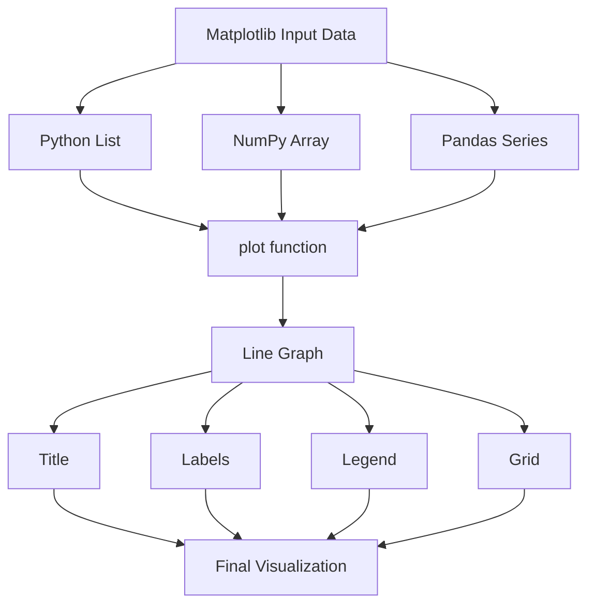

1. Write a script to create your first Matplotlib line plot using student marks obtained in five tests. Add a title, axis labels, and gridlines.
Answer:
```python
# ==========================================================
# FIRST LINE PLOT IN MATPLOTLIB
# ==========================================================
#
# Objective:
# Create a simple line graph showing marks obtained
# by a student in five tests.
#
# Concepts Covered:
# 1. Importing matplotlib
# 2. Creating a line plot
# 3. Adding title
# 4. Adding axis labels
# 5. Adding gridlines
# 6. Displaying the graph
#
# ==========================================================

# Step 1: Import pyplot module
import matplotlib.pyplot as plt

# Step 2: Prepare the data

# Test numbers
tests = [1, 2, 3, 4, 5]

# Marks obtained
marks = [65, 72, 68, 81, 90]

# Step 3: Create the line plot

plt.plot(
    tests,
    marks,
    marker='o',          # Circular marker
    linestyle='-',       # Solid line
    linewidth=2
)

# Step 4: Add chart elements

plt.title("Student Performance Across Tests")

plt.xlabel("Test Number")

plt.ylabel("Marks Obtained")

# Step 5: Add gridlines

plt.grid(True)

# Step 6: Display the graph

plt.show()
```
________________________________________
2. Create a graph using only Y-values. Explain how Matplotlib automatically generates X-values.
Answer:
```python
# ==========================================================
# Y-ONLY PLOTTING
# ==========================================================
#
# Objective:
# Plot a graph by supplying only Y-values.
#
# Concepts Covered:
# 1. Pattern-1 plotting
# 2. Automatic X-value generation
# 3. Implicit indexing
#
# ==========================================================

# Step 1: Import pyplot

import matplotlib.pyplot as plt

# Step 2: Create Y-values

sales = [120, 135, 150, 170, 165, 190]

# Step 3: Plot only Y-values

plt.plot(
    sales,
    marker='o',
    linewidth=2
)

# ----------------------------------------------------------
# Matplotlib automatically generates:
#
# X = [0,1,2,3,4,5]
#
# Resulting coordinate pairs become:
#
# (0,120)
# (1,135)
# (2,150)
# (3,170)
# (4,165)
# (5,190)
#
# ----------------------------------------------------------

# Step 4: Add title

plt.title("Monthly Sales (Y-Only Plot)")

# Step 5: Label axes

plt.xlabel("Auto Generated Index")

plt.ylabel("Sales")

# Step 6: Add grid

plt.grid(True)

# Step 7: Show graph

plt.show()
```
________________________________________
3. Write a script to plot the performance of three students on the same graph. Use different styles, markers, legend, title, and grid.
Answer:
```python
# ==========================================================
# MULTIPLE LINE PLOTS
# ==========================================================
#
# Objective:
# Plot marks of three students on one graph.
#
# Concepts Covered:
# 1. Multiple datasets
# 2. Legends
# 3. Markers
# 4. Different line styles
# 5. Comparative visualization
#
# ==========================================================

# Step 1: Import pyplot

import matplotlib.pyplot as plt

# Step 2: Create X-values

tests = [1, 2, 3, 4, 5]

# Step 3: Create datasets

alice = [65, 70, 75, 80, 90]

bob = [60, 68, 72, 78, 85]

charlie = [70, 72, 78, 84, 88]

# Step 4: Plot Student 1

plt.plot(
    tests,
    alice,
    marker='o',
    linestyle='-',
    label='Alice'
)

# Step 5: Plot Student 2

plt.plot(
    tests,
    bob,
    marker='s',
    linestyle='--',
    label='Bob'
)

# Step 6: Plot Student 3

plt.plot(
    tests,
    charlie,
    marker='^',
    linestyle=':',
    label='Charlie'
)

# Step 7: Add chart elements

plt.title("Comparison of Student Performance")

plt.xlabel("Test Number")

plt.ylabel("Marks")

# Step 8: Display legend

plt.legend()

# Step 9: Display grid

plt.grid(True)

# Step 10: Show graph

plt.show()
```
________________________________________
4. Write a script that plots the same dataset first using Python lists and then using NumPy arrays. Compare the approaches.
Answer:

```python
# ==========================================================
# LISTS VS NUMPY ARRAYS
# ==========================================================
#
# Objective:
# Plot identical data using:
# 1. Python lists
# 2. NumPy arrays
#
# Concepts Covered:
# 1. List-based plotting
# 2. NumPy-based plotting
# 3. Numerical computing
#
# ==========================================================

# Step 1: Import libraries

import matplotlib.pyplot as plt
import numpy as np

# ----------------------------------------------------------
# PART A : USING PYTHON LISTS
# ----------------------------------------------------------

# Step 2: Create list data

x_list = [1, 2, 3, 4, 5]

y_list = [10, 20, 30, 40, 50]

# Step 3: Plot list data

plt.figure(figsize=(8,4))

plt.plot(
    x_list,
    y_list,
    marker='o',
    label='List Data'
)

plt.title("Plot Using Python Lists")

plt.xlabel("X")

plt.ylabel("Y")

plt.grid(True)

plt.legend()

plt.show()

# ----------------------------------------------------------
# PART B : USING NUMPY ARRAYS
# ----------------------------------------------------------

# Step 4: Create NumPy arrays

x_np = np.array([1, 2, 3, 4, 5])

y_np = np.array([10, 20, 30, 40, 50])

# Step 5: Plot NumPy arrays

plt.figure(figsize=(8,4))

plt.plot(
    x_np,
    y_np,
    marker='s',
    label='NumPy Array Data'
)

plt.title("Plot Using NumPy Arrays")

plt.xlabel("X")

plt.ylabel("Y")

plt.grid(True)

plt.legend()

plt.show()

# ----------------------------------------------------------
# COMPARISON
# ----------------------------------------------------------
#
# Lists
# -----
# Easy to create
# Good for small datasets
#
# NumPy Arrays
# ------------
# Faster numerical operations
# Efficient memory usage
# Better for scientific computing
#
# Both can be plotted directly by Matplotlib.
#
# ----------------------------------------------------------
```
________________________________________
5. Write a script that plots identical data using a Python List, NumPy Array, and Pandas Series. Display all three in separate subplots and compare them.
Answer:

```python
# ==========================================================
# LISTS VS NUMPY VS PANDAS
# ==========================================================
#
# Objective:
# Plot identical data using:
#
# 1. Python List
# 2. NumPy Array
# 3. Pandas Series
#
# Concepts Covered:
# 1. Different data sources
# 2. Subplots
# 3. OOP-style plotting
# 4. Comparative visualization
#
# ==========================================================

# Step 1: Import required libraries

import matplotlib.pyplot as plt
import numpy as np
import pandas as pd

# Step 2: Create identical data

list_data = [10, 15, 20, 25, 30]

numpy_data = np.array([10, 15, 20, 25, 30])

pandas_data = pd.Series([10, 15, 20, 25, 30])

# Step 3: Create subplot structure

fig, ax = plt.subplots(
    nrows=3,
    ncols=1,
    figsize=(8, 10)
)

# ----------------------------------------------------------
# SUBPLOT 1
# ----------------------------------------------------------

ax[0].plot(
    list_data,
    marker='o'
)

ax[0].set_title("Python List")

ax[0].grid(True)

# ----------------------------------------------------------
# SUBPLOT 2
# ----------------------------------------------------------

ax[1].plot(
    numpy_data,
    marker='s'
)

ax[1].set_title("NumPy Array")

ax[1].grid(True)

# ----------------------------------------------------------
# SUBPLOT 3
# ----------------------------------------------------------

ax[2].plot(
    pandas_data,
    marker='^'
)

ax[2].set_title("Pandas Series")

ax[2].grid(True)

# Step 4: Improve spacing

plt.tight_layout()

# Step 5: Display graph

plt.show()

# ----------------------------------------------------------
# COMPARISON TABLE
# ----------------------------------------------------------
#
# +--------------+---------------------------+
# | Structure    | Primary Use               |
# +--------------+---------------------------+
# | List         | General Python data       |
# | NumPy Array  | Numerical computation     |
# | Pandas Series| Data analysis             |
# +--------------+---------------------------+
#
# Matplotlib can directly plot all three.
#
# ----------------------------------------------------------
```




6. Customise line appearance: Plot monthly sales and demonstrate different line styles, colours, markers, marker sizes, line widths, and transparency.
Answer:
```python
# ==========================================================
# CUSTOMIZING LINE APPEARANCE
# ==========================================================
#
# Objective:
# Demonstrate various line customization options.
#
# Concepts Covered:
# 1. color
# 2. linestyle
# 3. linewidth
# 4. marker
# 5. markersize
# 6. alpha (transparency)
#
# ==========================================================

# Step 1: Import Matplotlib

import matplotlib.pyplot as plt

# Step 2: Prepare data

months = ["Jan", "Feb", "Mar", "Apr", "May", "Jun"]

sales = [120, 150, 140, 180, 210, 250]

# Step 3: Create customized line graph

plt.plot(
    months,
    sales,

    color="blue",         # Line color

    linestyle="--",       # Dashed line

    linewidth=3,          # Thickness

    marker="o",           # Marker shape

    markersize=10,        # Marker size

    markerfacecolor="red",

    markeredgecolor="black",

    alpha=0.8             # Transparency
)

# Step 4: Add chart elements

plt.title("Monthly Sales Trend")

plt.xlabel("Month")

plt.ylabel("Sales")

plt.grid(True)

# Step 5: Display graph

plt.show()
```
________________________________________
7. Create a graph showing marks of three students. Add title, axis labels, legend, and explain the role of each chart element.
Answer:
```python
# ==========================================================
# TITLES, LABELS AND LEGENDS
# ==========================================================
#
# Objective:
# Demonstrate chart elements.
#
# Concepts Covered:
# 1. title()
# 2. xlabel()
# 3. ylabel()
# 4. legend()
#
# ==========================================================

# Step 1: Import library

import matplotlib.pyplot as plt

# Step 2: Create data

tests = [1, 2, 3, 4, 5]

alice = [60, 70, 75, 82, 88]

bob = [58, 68, 72, 76, 80]

charlie = [65, 74, 79, 85, 92]

# Step 3: Plot multiple datasets

plt.plot(tests, alice, marker="o", label="Alice")

plt.plot(tests, bob, marker="s", label="Bob")

plt.plot(tests, charlie, marker="^", label="Charlie")

# Step 4: Add title

plt.title("Performance Comparison")

# Step 5: Add axis labels

plt.xlabel("Test Number")

plt.ylabel("Marks Obtained")

# Step 6: Add legend

plt.legend()

# Step 7: Add grid

plt.grid(True)

# Step 8: Display graph

plt.show()

# ------------------------------------------------
# EXPLANATION
# ------------------------------------------------
#
# title()  -> Gives context to the graph.
#
# xlabel() -> Describes X-axis values.
#
# ylabel() -> Describes Y-axis values.
#
# legend() -> Identifies multiple datasets.
#
# ------------------------------------------------
```
________________________________________
8. Plot daily temperatures for ten days. Add gridlines and experiment with axis limits using xlim() and ylim().
Answer:
```python

# ==========================================================
# GRIDLINES AND AXIS LIMITS
# ==========================================================
#
# Objective:
# Demonstrate:
# 1. Gridlines
# 2. X-axis limits
# 3. Y-axis limits
#
# ==========================================================

# Step 1: Import pyplot

import matplotlib.pyplot as plt

# Step 2: Create data

days = [1,2,3,4,5,6,7,8,9,10]

temperature = [32,34,33,35,36,37,35,34,33,32]

# Step 3: Plot graph

plt.plot(
    days,
    temperature,
    marker="o"
)

# Step 4: Add chart elements

plt.title("Daily Temperature")

plt.xlabel("Day")

plt.ylabel("Temperature (°C)")

# Step 5: Add gridlines

plt.grid(True)

# ------------------------------------------------
# Axis Limits
# ------------------------------------------------

# Display only selected X range

plt.xlim(1, 10)

# Display only selected Y range

plt.ylim(30, 40)

# ------------------------------------------------

# Step 6: Display graph

plt.show()

```
________________________________________
9. Create a combined Bar Chart and Line Chart showing monthly sales and monthly profit in the same figure.
Answer:
```python
# ==========================================================
# COMBINED BAR + LINE CHART
# ==========================================================
#
# Objective:
# Show two related datasets
# using different chart types.
#
# Concepts Covered:
# 1. bar()
# 2. plot()
# 3. Mixed visualization
#
# ==========================================================

# Step 1: Import pyplot

import matplotlib.pyplot as plt

# Step 2: Create data

months = ["Jan","Feb","Mar","Apr","May","Jun"]

sales = [120,150,180,200,240,260]

profit = [15,20,28,30,40,45]

# Step 3: Create bar chart

plt.bar(
    months,
    sales,
    label="Sales"
)

# Step 4: Create line chart

plt.plot(
    months,
    profit,

    marker="o",

    linewidth=3,

    label="Profit"
)

# Step 5: Add chart elements

plt.title("Sales and Profit Analysis")

plt.xlabel("Month")

plt.ylabel("Value")

# Step 6: Add legend

plt.legend()

# Step 7: Add grid

plt.grid(True)

# Step 8: Show graph

plt.show()
```
________________________________________
10. Recreate a multi-line chart using the Object-Oriented (fig, ax) approach instead of the state-based pyplot approach.
Answer:

```python
# ==========================================================
# OBJECT ORIENTED PLOTTING
# ==========================================================
#
# Objective:
# Create graph using:
#
# fig
# ax
#
# instead of directly using plt.plot()
#
# Concepts Covered:
#
# 1. Figure object
# 2. Axes object
# 3. OOP plotting style
# 4. Professional plotting
#
# ==========================================================

# Step 1: Import library

import matplotlib.pyplot as plt

# Step 2: Create data

tests = [1,2,3,4,5]

alice = [65,72,78,82,90]

bob = [60,68,74,79,84]

charlie = [70,75,80,86,92]

# ------------------------------------------------
# Step 3:
# Create Figure and Axes objects
# ------------------------------------------------

fig, ax = plt.subplots(
    figsize=(8,5)
)

# ------------------------------------------------
# Step 4:
# Plot using Axes methods
# ------------------------------------------------

ax.plot(
    tests,
    alice,
    marker="o",
    label="Alice"
)

ax.plot(
    tests,
    bob,
    marker="s",
    label="Bob"
)

ax.plot(
    tests,
    charlie,
    marker="^",
    label="Charlie"
)

# ------------------------------------------------
# Step 5:
# Customize Axes
# ------------------------------------------------

ax.set_title(
    "Student Performance Comparison"
)

ax.set_xlabel(
    "Test Number"
)

ax.set_ylabel(
    "Marks"
)

ax.grid(True)

ax.legend()

# ------------------------------------------------
# Step 6:
# Display graph
# ------------------------------------------------

plt.show()

# =================================================
# OOP STRUCTURE
# =================================================
#
# Figure
#   |
#   +---- Axes
#            |
#            +---- plot()
#            +---- set_title()
#            +---- set_xlabel()
#            +---- set_ylabel()
#            +---- legend()
#            +---- grid()
#
# =================================================
```
________________________________________


11. Create a bar chart project showing the number of books issued by different departments in a college library. Add data labels, title, labels, legend, and gridlines.
Answer:
```python
# ==========================================================
# BAR CHART PROJECT
# ==========================================================
#
# Objective:
# Visualize the number of books issued by
# different departments.
#
# Concepts Covered:
# 1. Bar charts
# 2. Data labels
# 3. Titles and labels
# 4. Gridlines
# 5. Iterating over bars
#
# ==========================================================

# Step 1: Import Matplotlib

import matplotlib.pyplot as plt

# Step 2: Create data

departments = [
    "Computer",
    "Mechanical",
    "Civil",
    "Electrical",
    "Management"
]

books_issued = [450, 320, 280, 260, 390]

# Step 3: Create figure

plt.figure(figsize=(10,5))

# Step 4: Create bars

bars = plt.bar(
    departments,
    books_issued,
    label="Books Issued"
)

# Step 5: Add data labels

for bar in bars:

    height = bar.get_height()

    plt.text(
        bar.get_x() + bar.get_width()/2,
        height + 5,
        str(height),
        ha='center'
    )

# Step 6: Add chart elements

plt.title("Books Issued by Department")

plt.xlabel("Department")

plt.ylabel("Number of Books")

plt.grid(axis='y')

plt.legend()

# Step 7: Display graph

plt.show()
```
________________________________________
12. Create a pie chart showing a family's monthly expenses. Use explode to highlight the largest expense category.
Answer:
```python
# ==========================================================
# PIE CHART WITH EXPLODE
# ==========================================================
#
# Objective:
# Highlight one slice using explode.
#
# Concepts Covered:
# 1. Pie chart
# 2. explode
# 3. percentages
# 4. labels
#
# ==========================================================

# Step 1: Import library

import matplotlib.pyplot as plt

# Step 2: Create data

categories = [
    "Rent",
    "Food",
    "Transport",
    "Education",
    "Entertainment"
]

expenses = [25000, 12000, 5000, 7000, 3000]

# Step 3: Create explode tuple

explode = (
    0.1,   # Rent highlighted
    0,
    0,
    0,
    0
)

# Step 4: Create pie chart

plt.pie(
    expenses,

    labels=categories,

    autopct='%1.1f%%',

    explode=explode,

    shadow=True,

    startangle=90
)

# Step 5: Add title

plt.title("Monthly Family Expenses")

# Step 6: Display chart

plt.show()
```
________________________________________
13. Create a histogram showing examination marks of 100 students. Use custom bins and explain how bins affect the distribution.
Answer:
```python
# ==========================================================
# HISTOGRAM WITH CUSTOM BINS
# ==========================================================
#
# Objective:
# Study distribution of marks.
#
# Concepts Covered:
# 1. Histogram
# 2. Frequency distribution
# 3. Custom bins
#
# ==========================================================

# Step 1: Import libraries

import matplotlib.pyplot as plt
import numpy as np

# Step 2: Generate sample marks

np.random.seed(10)

marks = np.random.normal(
    loc=70,
    scale=10,
    size=100
)

# Step 3: Create custom bins

custom_bins = [
    30,40,50,60,70,80,90,100
]

# Step 4: Create histogram

plt.hist(
    marks,
    bins=custom_bins,
    edgecolor='black'
)

# Step 5: Add chart elements

plt.title("Distribution of Examination Marks")

plt.xlabel("Marks")

plt.ylabel("Frequency")

plt.grid(True)

# Step 6: Display graph

plt.show()

# --------------------------------------------------
# BIN INTERPRETATION
# --------------------------------------------------
#
# 30-40
# 40-50
# 50-60
# 60-70
# 70-80
# 80-90
# 90-100
#
# Each bar shows how many students
# fall into a particular range.
#
# Smaller bins:
# More detail
#
# Larger bins:
# Less detail but smoother graph
#
# --------------------------------------------------
```
________________________________________
14. Create a scatter plot to study the relationship between study hours and examination marks. Identify possible trends and outliers.
Answer:
```python
# ==========================================================
# SCATTER PLOT ANALYSIS
# ==========================================================
#
# Objective:
# Explore relationship between
# study hours and marks.
#
# Concepts Covered:
# 1. Scatter plot
# 2. Correlation
# 3. Trend analysis
# 4. Outlier detection
#
# ==========================================================

# Step 1: Import library

import matplotlib.pyplot as plt

# Step 2: Create data

study_hours = [
    1,2,3,4,5,
    6,7,8,9,10
]

marks = [
    35,40,50,58,62,
    70,74,82,88,95
]

# Step 3: Create scatter plot

plt.scatter(
    study_hours,
    marks,
    s=100
)

# Step 4: Add chart elements

plt.title("Study Hours vs Marks")

plt.xlabel("Study Hours")

plt.ylabel("Marks Obtained")

plt.grid(True)

# Step 5: Display graph

plt.show()

# --------------------------------------------------
# ANALYSIS
# --------------------------------------------------
#
# Positive Correlation:
# More study hours generally
# lead to higher marks.
#
# Outliers:
# Any point far from the
# general trend line may
# indicate unusual behaviour.
#
# Scatter plots are excellent
# for detecting relationships.
#
# --------------------------------------------------
```
________________________________________
15. Create both a Box Plot and a Violin Plot for the same salary dataset. Compare the information provided by each visualization.
Answer:
```python
# ==========================================================
# BOX PLOT VS VIOLIN PLOT
# ==========================================================
#
# Objective:
# Compare two distribution plots.
#
# Concepts Covered:
# 1. Box plot
# 2. Violin plot
# 3. Median
# 4. Quartiles
# 5. Distribution shape
#
# ==========================================================

# Step 1: Import libraries

import matplotlib.pyplot as plt
import numpy as np

# Step 2: Create salary dataset

salary = np.array([
    25000,28000,30000,32000,
    35000,37000,40000,42000,
    45000,48000,50000,55000,
    60000,65000,70000
])

# Step 3: Create figure with subplots

fig, ax = plt.subplots(
    1,
    2,
    figsize=(12,5)
)

# --------------------------------------------------
# BOX PLOT
# --------------------------------------------------

ax[0].boxplot(salary)

ax[0].set_title("Box Plot")

ax[0].set_ylabel("Salary")

ax[0].grid(True)

# --------------------------------------------------
# VIOLIN PLOT
# --------------------------------------------------

ax[1].violinplot(salary)

ax[1].set_title("Violin Plot")

ax[1].set_ylabel("Salary")

ax[1].grid(True)

# --------------------------------------------------
# Display figure
# --------------------------------------------------

plt.tight_layout()

plt.show()

# --------------------------------------------------
# COMPARISON
# --------------------------------------------------
#
# BOX PLOT
# --------
# Shows:
# - Minimum
# - Q1
# - Median
# - Q3
# - Maximum
# - Outliers
#
# Excellent summary statistics.
#
# VIOLIN PLOT
# -----------
# Shows:
# - Distribution shape
# - Density estimation
# - Spread of data
#
# Useful when understanding
# the shape of the distribution
# is important.
#
# --------------------------------------------------
```
________________________________________
Comparative Table: Distribution Visualizations


16. Create a heat map using imshow() to visualize the marks obtained by students in five subjects. Add a color bar, title, and axis labels.
Answer:
```python
# ==========================================================
# MATRIX VISUALIZATION USING imshow()
# ==========================================================
#
# Objective:
# Visualize matrix data using a heat map.
#
# Concepts Covered:
# 1. Matrix data
# 2. imshow()
# 3. Color mapping
# 4. Color bar
# 5. Axis labels
#
# ==========================================================

# Step 1: Import libraries

import matplotlib.pyplot as plt
import numpy as np

# Step 2: Create matrix data
#
# Rows    -> Students
# Columns -> Subjects

marks = np.array([
    [78, 82, 85, 80, 76],
    [88, 91, 79, 85, 90],
    [65, 72, 70, 68, 75],
    [92, 89, 94, 96, 91],
    [81, 83, 80, 79, 84]
])

# Step 3: Create figure

plt.figure(figsize=(8,6))

# Step 4: Display matrix

image = plt.imshow(
    marks,
    cmap="viridis",
    aspect="auto"
)

# Step 5: Add color bar

plt.colorbar(
    image,
    label="Marks"
)

# Step 6: Label axes

subjects = [
    "Math",
    "Physics",
    "Chemistry",
    "English",
    "CS"
]

students = [
    "S1",
    "S2",
    "S3",
    "S4",
    "S5"
]

plt.xticks(
    range(len(subjects)),
    subjects
)

plt.yticks(
    range(len(students)),
    students
)

# Step 7: Add title

plt.title("Student Marks Heat Map")

plt.xlabel("Subjects")

plt.ylabel("Students")

# Step 8: Show graph

plt.show()
```
________________________________________
17. Create contour and contourf plots of a mathematical surface defined by z = sin(x² + y²). Compare the two visualizations.
Answer:
```python
# ==========================================================
# CONTOUR AND CONTOURF VISUALIZATION
# ==========================================================
#
# Objective:
# Visualize a mathematical surface.
#
# Concepts Covered:
# 1. Meshgrid
# 2. Contour lines
# 3. Filled contours
# 4. Matrix-based visualization
#
# ==========================================================

# Step 1: Import libraries

import matplotlib.pyplot as plt
import numpy as np

# Step 2: Create X and Y values

x = np.linspace(-3, 3, 200)

y = np.linspace(-3, 3, 200)

# Step 3: Create mesh grid

X, Y = np.meshgrid(x, y)

# Step 4: Compute Z values

Z = np.sin(X**2 + Y**2)

# Step 5: Create figure

fig, ax = plt.subplots(
    1,
    2,
    figsize=(12,5)
)

# --------------------------------------------------
# CONTOUR PLOT
# --------------------------------------------------

contour_lines = ax[0].contour(
    X,
    Y,
    Z
)

ax[0].clabel(contour_lines)

ax[0].set_title("Contour Plot")

# --------------------------------------------------
# CONTOURF PLOT
# --------------------------------------------------

filled = ax[1].contourf(
    X,
    Y,
    Z
)

fig.colorbar(
    filled,
    ax=ax[1]
)

ax[1].set_title("Contourf Plot")

# Step 6: Improve layout

plt.tight_layout()

# Step 7: Display graph

plt.show()

# --------------------------------------------------
# COMPARISON
# --------------------------------------------------
#
# contour()
# ----------
# Draws contour lines.
# Similar to topographic maps.
#
# contourf()
# ----------
# Fills regions between contours.
# Easier to identify value ranges.
#
# --------------------------------------------------
```
________________________________________
18. Create a graph of monthly sales and use text annotations to highlight the highest and lowest sales values.
Answer:
```python
# ==========================================================
# TEXT ANNOTATIONS
# ==========================================================
#
# Objective:
# Highlight important points on a graph.
#
# Concepts Covered:
# 1. annotate()
# 2. text()
# 3. Data storytelling
#
# ==========================================================

# Step 1: Import pyplot

import matplotlib.pyplot as plt

# Step 2: Create data

months = [
    "Jan","Feb","Mar",
    "Apr","May","Jun"
]

sales = [
    120,150,100,
    180,210,170
]

# Step 3: Plot graph

plt.plot(
    months,
    sales,
    marker='o'
)

# Step 4: Find highest and lowest points

highest_value = max(sales)

lowest_value = min(sales)

highest_index = sales.index(highest_value)

lowest_index = sales.index(lowest_value)

# Step 5: Annotate highest value

plt.annotate(
    "Highest Sales",

    xy=(
        months[highest_index],
        highest_value
    ),

    xytext=(
        months[highest_index],
        highest_value + 25
    ),

    arrowprops={
        "arrowstyle":"->"
    }
)

# Step 6: Annotate lowest value

plt.annotate(
    "Lowest Sales",

    xy=(
        months[lowest_index],
        lowest_value
    ),

    xytext=(
        months[lowest_index],
        lowest_value + 25
    ),

    arrowprops={
        "arrowstyle":"->"
    }
)

# Step 7: Add chart elements

plt.title("Monthly Sales Analysis")

plt.xlabel("Month")

plt.ylabel("Sales")

plt.grid(True)

# Step 8: Show graph

plt.show()
```
________________________________________
19. Create the same graph using the ggplot style and the dark_background style. Compare the results.
Answer:
```python
# ==========================================================
# MATPLOTLIB STYLES
# ==========================================================
#
# Objective:
# Demonstrate style sheets.
#
# Concepts Covered:
# 1. ggplot style
# 2. dark_background style
# 3. Visual themes
#
# ==========================================================

# Step 1: Import library

import matplotlib.pyplot as plt

# Step 2: Create data

months = [
    "Jan","Feb","Mar",
    "Apr","May","Jun"
]

sales = [
    120,150,180,
    170,220,250
]

# --------------------------------------------------
# GRAPH 1 : GGPLOT STYLE
# --------------------------------------------------

plt.style.use("ggplot")

plt.figure(figsize=(8,4))

plt.plot(
    months,
    sales,
    marker='o'
)

plt.title("Sales Trend - ggplot Style")

plt.show()

# --------------------------------------------------
# GRAPH 2 : DARK BACKGROUND
# --------------------------------------------------

plt.style.use("dark_background")

plt.figure(figsize=(8,4))

plt.plot(
    months,
    sales,
    marker='o'
)

plt.title("Sales Trend - Dark Background")

plt.show()

# --------------------------------------------------
# COMPARISON
# --------------------------------------------------
#
# ggplot
# ------
# Inspired by R's ggplot2
# Professional appearance
#
# dark_background
# ---------------
# Dark theme
# Suitable for presentations
#
# --------------------------------------------------
```
________________________________________
20. Create a graph and save it in PNG, PDF, and SVG formats using savefig(). Verify that the file is saved before displaying the graph.
Answer:
```python
# ==========================================================
# SAVING GRAPHS USING savefig()
# ==========================================================
#
# Objective:
# Save graphs in multiple formats.
#
# Concepts Covered:
# 1. savefig()
# 2. PNG format
# 3. PDF format
# 4. SVG format
#
# ==========================================================

# Step 1: Import pyplot

import matplotlib.pyplot as plt

# Step 2: Create data

years = [
    2020,
    2021,
    2022,
    2023,
    2024
]

revenue = [
    120,
    150,
    180,
    220,
    260
]

# Step 3: Create graph

plt.plot(
    years,
    revenue,
    marker='o'
)

# Step 4: Add chart elements

plt.title("Company Revenue Growth")

plt.xlabel("Year")

plt.ylabel("Revenue")

plt.grid(True)

# --------------------------------------------------
# Step 5:
# Save BEFORE show()
# --------------------------------------------------

plt.savefig(
    "revenue_chart.png",
    dpi=300
)

plt.savefig(
    "revenue_chart.pdf"
)

plt.savefig(
    "revenue_chart.svg"
)

# --------------------------------------------------
# Optional Verification
# --------------------------------------------------

print("Files saved successfully.")

# Step 6: Display graph

plt.show()

# --------------------------------------------------
# WHY SAVE BEFORE show()?
# --------------------------------------------------
#
# Some environments may clear
# or close the figure after
# displaying it.
#
# Saving first ensures that
# the graph is safely written
# to disk.
#
# --------------------------------------------------
```
________________________________________
Comparative Table – Matrix and Scientific Visualizations


