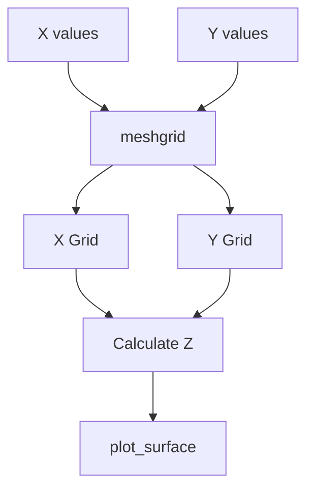
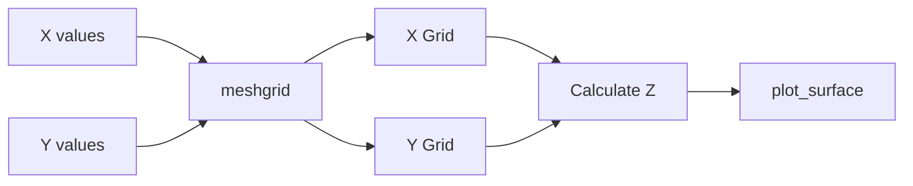

# Introduction to 3D Plotting

### Relationship Between 2D and 3D Plotting

Matplotlib was originally designed for creating two-dimensional (2D) visualizations. However, the library was later extended to support three-dimensional (3D) plotting while retaining a similar programming interface wherever possible.

As a result, many plotting methods such as `plot()` and `scatter()` can be used in both 2D and 3D. The only difference is that a third coordinate (`z`) must be supplied when working in 3D. This consistency in the API makes it easier to learn 3D plotting once the corresponding 2D plots are understood.

Not all plots, however, have a natural three-dimensional interpretation. For example, `pie charts, box plots and violin plots` are primarily designed for two-dimensional data visualization and are therefore used almost exclusively in 2D.

Conversely, certain plots such as `surface plots` and `wireframe plots` are specifically designed for representing three-dimensional objects and have no meaningful two-dimensional equivalent.

Thus, Matplotlib plotting methods can be broadly divided into three categories:

1.  **Plots primarily used only in 2D**
2.  **Plots that work in both 2D and 3D**
3.  **Plots specifically designed for 3D visualization**

The following sections discuss these three categories.


## 1. Plots Primarily Used Only in 2D

Some plotting methods are designed to summarize, compare or categorize data on a flat two-dimensional surface. Although it is sometimes possible to create three-dimensional versions of certain charts, doing so rarely provides additional information and may even make the visualization harder to interpret.

For this reason, the following plots are generally used only in 2D.

### Why Not Use Them in 3D?

A graph should make data easier to understand. Adding a third dimension is useful only when there is a meaningful third variable to display.

For example:

-   A pie chart already represents proportions using angles and areas. A third dimension does not add useful information.
-   A histogram displays a frequency distribution. The bars already represent frequencies; a third dimension may only distort perception.
-   A box plot summarizes quartiles, median and outliers. These concepts are inherently one-dimensional and do not benefit from an additional axis.

Thus, while 3D is useful for visualizing surfaces and spatial data, many statistical charts are best kept in 2D.

----------

### Common 2D-Only Plots

| Method | Purpose | Why 3D Adds Little Value |
| --- | --- | --- |
| pie() | Parts of a whole | Proportions already visible in 2D |
| boxplot() | Distribution summary | Quartiles and median are 1D concepts |
| violinplot() | Distribution shape | Density is already shown completely in 2D |
| stem() | Discrete sampled values | Third dimension rarely meaningful |
| imshow() | Display image/matrix | Images are naturally 2D |
| hist() | Frequency distribution | Extra dimension often causes visual distortion |
| bar() | Category comparison | 3D bars may look attractive but often reduce readability |

### A Useful Rule

```
If the graph summarizes data,
it is usually best kept in 2D.

If the graph represents a physical surface,
spatial position, or mathematical surface,
3D may be appropriate.
```

### Learning Point

```
2D Charts
     ↓
Summarize or compare data

3D Charts
     ↓
Represent surfaces,
shapes or 
spatial relationships
```

Therefore, most statistical charts are naturally two-dimensional and are typically used in that form.


Note
>**histograms** and **bar charts** as **"primarily 2D"** rather than strictly "2D-only". 
>Matplotlib and many other libraries can create 3D versions of them, but those versions are generally considered less effective for data communication. 
>In contrast, `pie()`, `boxplot()`, `violinplot()`, and `imshow()` are much closer to being genuinely 2D-only in practical use.


## 2. Plots That Work in Both 2D and 3D

Matplotlib follows a consistent design philosophy wherever possible. As a result, some plotting methods can be used in both two-dimensional and three-dimensional visualizations.

The basic plotting logic remains the same. The main difference is that a third coordinate (`z`) must be supplied when plotting in 3D.

Thus, if a 2D plot uses coordinates:

```
(x, y)
```

then the corresponding 3D plot uses:

```
(x, y, z)
```

This consistency makes it easier to learn 3D plotting after understanding the corresponding 2D plots.

----------

### Common Methods Available in Both 2D and 3D

| Method | 2D Form | 3D Form | Additional Requirement |
| --- | --- | --- | --- |
| plot() | Line plot | 3D curve | Supply z values |
| scatter() | Scatter plot | 3D scatter plot | Supply z values |


### Additional Setup Required for 3D

Before using 3D plotting, a 3D Axes object must be created.

```
fig, ax = plt.subplots(
    subplot_kw={"projection":"3d"}
)
```

The keyword:

```
projection="3d"
```

tells Matplotlib to create a three-dimensional plotting area.

----------

### `plot()` : 2D vs 3D

#### 2D Version

```
ax.plot(x, y)
```

#### 3D Version

```
ax.plot(x, y, z)
```

Only one additional argument (`z`) is required.

----------

### `scatter()` : 2D vs 3D

#### 2D Version

```
ax.scatter(x, y)
```

#### 3D Version

```
ax.scatter(x, y, z)
```

Again, the only difference is the addition of z-coordinates.

----------

### Comparison Table

| Feature | 2D Plot | 3D Plot |
| --- | --- | --- |
| Coordinates Required | x, y | x, y, z |
| Axes | X and Y | X, Y and Z |
| Projection Needed | No | projection="3d" |
| Visual Depth | No | Yes |

### Learning Point

Most of the programming effort involved in moving from 2D to 3D plotting is simply:

1.  Creating a 3D Axes object.
2.  Supplying z-coordinates.

The plotting methods themselves remain largely unchanged.


## 3. Plots Specifically Designed for 3D Visualization

Some data naturally contains three variables and therefore requires three-dimensional visualization. In such cases, simply extending a 2D plot by adding a z-coordinate may not be sufficient.

Matplotlib therefore provides several plotting methods that are specifically designed for three-dimensional data. These methods visualize surfaces, shapes and spatial relationships that cannot be represented effectively using ordinary 2D charts.

----------

### When are 3D Plots Useful?

3D plots are commonly used for:

-   Mathematical surfaces
-   Terrain and elevation maps
-   Engineering simulations
-   Scientific measurements
-   Temperature and pressure distributions
-   Financial and optimization surfaces
-   Any data of the form:

```
z = f(x,y)
```

where the value of **z** depends on both **x** and **y**.

----------

### Common 3D-Specific Methods


| Method | Purpose | Typical Use | Input Required |
| --- | --- | --- | --- |
| plot_surface() | Draw solid surface | Mathematical surfaces | X, Y, Z grids |
| plot_wireframe() | Draw mesh surface | Structure visualization | X, Y, Z grids |
| contour3D() | Draw 3D contour lines | Level curves | X, Y, Z grids |
| plot_trisurf() | Draw irregular surface | Scattered measurements | X, Y, Z points |
| voxels() | Draw 3D blocks | Volume visualization | 3D arrays |


### Why Surface and Wireframe Plots Need Mesh Grids

A line plot requires only:

```
x
y
```

values.

A surface plot requires:

```
x
y
z
```

for many combinations of x and y.

Therefore Matplotlib expects coordinate grids rather than simple lists.

These grids are usually created using:

```
X, Y = np.meshgrid(x, y)
```

----------

### Surface Plot Workflow



----------

### Surface Plot vs Wireframe Plot


| Feature | Surface Plot | Wireframe Plot |
| --- | --- | --- |
| Appearance | Solid surface | Mesh structure |
| Color Mapping | Yes | Usually No |
| Easier to Visualize Shape | Yes | Moderate |
| Shows Grid Structure | No | Yes |
| Rendering Speed | Slower | Faster |


### Typical Surface Plot

```python
ax.plot_surface(
    X,
    Y,
    Z,
    cmap="viridis"
)
```

This creates a solid colored surface.

----------

### Typical Wireframe Plot

```python
ax.plot_wireframe(
    X,
    Y,
    Z
)
```

This creates a mesh representation of the same surface.

----------

### Points to Watch Out For

#### 1. Projection Must Be 3D

A 3D axes must be created first.

```
fig, ax = plt.subplots(
    subplot_kw={"projection":"3d"}
)
```

Otherwise Matplotlib will raise an error because ordinary 2D axes do not understand 3D plotting methods.

----------

#### 2. X, Y and Z Must Have Matching Shapes

The arrays supplied to:

```
plot_surface()
plot_wireframe()
```

must have compatible dimensions.

For example:

```python
X.shape = (50,50)
Y.shape = (50,50)
Z.shape = (50,50)
```

----------

#### 3. `meshgrid()` is Usually Required

Beginners often try:

```
ax.plot_surface(x, y, z)
```

where x, y and z are simple one-dimensional arrays.

This usually fails because surface plots expect two-dimensional coordinate grids.

----------

#### 4. Large Grids Can Be Slow

For example:

```python
500 × 500
```

creates:

```python
250,000 points
```

which may slow rendering.

Smaller grids such as:

```
50 × 50
```

are usually sufficient for learning and experimentation.

----------

### Common Beginner Errors

| Error | Cause | Solution |
| --- | --- | --- |
| No z-axis visible | Forgot projection="3d" | Create 3D axes |
| Shape mismatch error | X, Y, Z have different sizes | Ensure matching dimensions |
| Surface not displayed correctly | Missing meshgrid() | Generate coordinate grids |
| Plot appears slow | Too many grid points | Reduce grid resolution |

### Learning Point

```python
1. 2D Plot ⟶ Visualize points and curves

2. 3D Plot ⟶ Visualize surfaces and shapes

3. meshgrid() ⟶ Creates coordinate grid

4. plot_surface() ⟶ Solid surface

5. plot_wireframe() ⟶ Surface skeleton
```

For most beginners, understanding `meshgrid()`, `plot_surface()` and `plot_wireframe()` is sufficient to understand the basic principles of three-dimensional visualization in Matplotlib.


## Understanding `np.meshgrid()`

When plotting a mathematical surface, we need values of **z** for many combinations of **x** and **y**.

For example, consider the function:

$x^2 + y^2$


To calculate z, we cannot use only a list of x-values or only a list of y-values. Instead, we need every possible combination of x and y coordinates.

The `np.meshgrid()` function creates such a coordinate grid.

----------

### Why is meshgrid Needed?

Suppose:

```
x = [1, 2, 3]
y = [10, 20]
```

A surface plot requires the following coordinate pairs:

```
(1,10)  (2,10)  (3,10)

(1,20)  (2,20)  (3,20)
```

Notice that every x-value must be combined with every y-value.

`meshgrid()` automatically creates these combinations.

----------

### Simplified Signature

```
X, Y = np.meshgrid(x, y)
```

----------

### Example

```
import numpy as np

x = [1, 2, 3]
y = [10, 20]

X, Y = np.meshgrid(x, y)

print(X)
print(Y)
```

Output:

```
X

[[1 2 3]
 [1 2 3]]

Y

[[10 10 10]
 [20 20 20]]
```

----------

### Visual Interpretation


|  |  | X | ⟶ | ⟶ |
| --- | --- | --- | --- | --- |
|  |  | 1 | 2 | 3 |
| Y | 10 | (1, 10) | (2, 10) | (3, 10) |
| ↓ | 20 | (1, 20) | (2, 20) | (3, 20) |
| ↓ | 30 | (1, 30) | (2, 30) | (3, 30) |


### Note: Coordinates vs Matrix Indexing

When working with `meshgrid()`, it is important to remember that coordinates are written in the form:

```python
(x, y)
```

where:

-   **x** represents the horizontal direction (left to right)
-   **y** represents the vertical direction (top to bottom in the grid representation shown above)

Thus, the coordinate:

```python
(2,10)
```

means:

-   x = 2 (second column)
-   y = 10 (first row)

This is different from matrix indexing, where elements are typically accessed using:

```
(row, column)
```

and the row number is written before the column number.

For example:

```
Matrix Indexing      Coordinate System

(row, column)        (x, y)

(1,2)                (2,10)
```

Therefore, when interpreting the output of `meshgrid()`, think in terms of **Cartesian coordinates (x,y)** rather than **matrix positions (row,column)**.


----------

### How Surface Plots Use meshgrid()



----------

### Typical Workflow

```
x = np.linspace(-3, 3, 50)
y = np.linspace(-3, 3, 50)

X, Y = np.meshgrid(x, y)

Z = X**2 + Y**2

ax.plot_surface(X, Y, Z)
```

Here:

-   `X` contains x-coordinates of the grid.
-   `Y` contains y-coordinates of the grid.
-   `Z` contains the corresponding height values.
-   `plot_surface()` uses these three grids to draw the surface.

----------

### A Useful Analogy

Imagine a chessboard.

-   The columns represent x-values.
-   The rows represent y-values.
-   Every square corresponds to one `(x,y)` coordinate pair.

`meshgrid()` creates this rectangular coordinate framework on which the surface is built.

----------

### Key Learning Point

```
x values
     +
y values
     ↓
meshgrid()
     ↓
Coordinate Grid
     ↓
Calculate z values
     ↓
Create Surface Plot
```

Thus, `meshgrid()` is not a plotting function. It is a helper function that generates the coordinate grid required by many 3D plotting methods.

## Some additional issues in 3D plotting

### 1. Viewing Angle

Students often ask:

> Why does the same 3D plot look different in different books?

The answer is the viewing angle.

### Simplified Signature

```python
ax.view_init(    
            elev=30,    
            azim=45)
```

### Parameters

| Parameter | Meaning | Effect |
| --- | --- | --- |
| elev | Elevation angle | Up/down viewing angle |
| azim | Azimuth angle | Left/right rotation |


### Example

```python
ax.view_init(    
             elev=20,    
             azim=60
)
```

This rotates the camera without changing the data.

### 2. Colormaps

Simple script as follows can be quite boring:

```python
ax.plot_surface(...)
```
Then:

```
ax.plot_surface(    
               X, 
               Y, 
               Z,    
               cmap="viridis"
)
```

looks much better.

### Common Colormaps

| Colormap | Appearance |
| --- | --- |
| "viridis" | Blue → Green → Yellow |
| "plasma" | Purple → Orange |
| "inferno" | Dark → Bright |
| "coolwarm" | Blue ↔ Red |
| "spring" | Pink → Yellow |


### 3. Surface vs Wireframe Comparison


```python
Surface ⟶ Shows shape
Wireframe ⟶ Shows structure
```


----------

### 4. Why Not Everything Should Be 3D


> Although 3D plots look attractive, they should be used only when a meaningful third variable exists. Unnecessary 3D effects may make graphs harder to interpret.


### 5. Color Bar

Surface plots often use:

```
fig.colorbar(surface)
```

### Example

```python
# plot_surface() creates a 3D surface plot.
# In virdis, low Z values⟶ dark purple
# high Z values ⟶ bright yellow. This makes the colormap meaningful.
surface = ax.plot_surface(X, Y, Z,cmap="viridis")
# Add a color bar to show the mapping of Z values to colors
fig.colorbar(surface)
```

### Script 1 Helix
Introductory Note

A helix may be thought of as a circle that gradually rises in height. As a point moves around the circumference of the circle, its z-coordinate continuously increases. This example demonstrates the use of the 3D version of `plot()`, which requires x, y and z coordinates.

----------

### 3D Helix Using plot(x, y, z)


```python

# Import required modules
import numpy as np
import matplotlib.pyplot as plt

# Create Figure and 3D Axes. subplot_kw={"projection": "3d"} creates a 3D plot.
fig, ax = plt.subplots(
    figsize=(8, 6),
    subplot_kw={"projection": "3d"}
)

# Generate parameter values. t is a sequence of 1000 values from 0 to 20π, 
# which will create multiple turns of the helix.
t = np.linspace(0, 20 * np.pi, 1000)

# Radius of helix. A larger radius will create a wider helix, 
# while a smaller radius will create a tighter helix.
r = 5

# Coordinates of helix. The x and y coordinates are calculated using cosine and sine functions,
# which create a circular pattern in the XY plane. The z coordinate increases linearly, 
# creating the vertical progression of the helix.
x = r * np.cos(t)
y = r * np.sin(t)

# Height increases gradually. The z coordinate is simply the parameter t, which means that as t increases,
# the height of the helix increases, creating a spiral effect.
z = np.linspace(0, 10, 1000)

# Create 3D line plot. The color is set to blue and the line width is set to 2 for better visibility.
ax.plot(
    x,
    y,
    z,
    color="blue",
    linewidth=2
)

# Add title and axis labels
ax.set_title("3D Helix")
ax.set_xlabel("X-axis")
ax.set_ylabel("Y-axis")
ax.set_zlabel("Z-axis")

# Display graph
plt.show()
# After closure print shape and statistics of the cone matrix for reference, verification and learning purposes. This will help us understand the dimensions and value distribution of the matrix we created.
print("X Coordinates Shape:", x.shape)
print("Y Coordinates Shape:", y.shape)
print("Z Coordinates Shape:", z.shape)
print("X Coordinates Statistics: min =", np.min(x), ", max =", np.max(x), ", mean =", np.mean(x))
print("Y Coordinates Statistics: min =", np.min(y), ", max =", np.max(y), ", mean =", np.mean(y))
print("Z Coordinates Statistics: min =", np.min(z), ", max =", np.max(z), ", mean =", np.mean(z))


```


