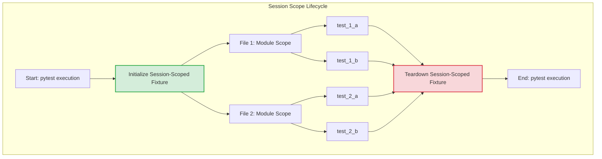

#  Advanced Fixture Lifecycles and Optimization

## Theoretical Foundation: Session Scope

In real world software development, test suites may have hundreds or thousands of test cases. When executing these tests, certain infrastructure requirements—such as establishing database connections, or authenticating with external APIs— create heavy burdern on the computational resources.
If a test had to do setup and teardown for example for an API call or a Database connection for each test, it would be extremely expensive and time consuming. 
Pytest resolves this problem through **Fixture Scoping**. Fixtures are scoped as per the need of the test.
The highest and most persistent tier of this hierarchy is the **Session Scope** (`scope="session"`).

### The Fixture Lifecycle Hierarchy

-   **Function Scope (Default):** The fixture is set up before, and torn down after, _each individual test function_.
    
-   **Class Scope:** The fixture is set up once per test class, regardless of the number of methods within that class.
    
-   **Module Scope:** The fixture is set up once per Python file (`.py`), sharing state among all test functions inside that file.
    
-   **Session Scope:** The fixture is set up exactly **once** at the inception of the entire test invocation and is torn down only after all discovered test files have finished executing.
    

Code snippet



## Application Simulation Architectural Design

To understand the practical implications of session scoping without relying on live external networks, we implement an application simulation representing an external financial gateway (e.g., Stripe or PayPal).

### 1. Target Implementation: `payment_gateway.py`

This module acts as a stateful emulator. It enforces linear state progression (Connection $\rightarrow$ Processing $\rightarrow$ Disconnection) and introduces simulated network latency.

```python
# payment_gateway.py
"""
Module: payment_gateway
Description: Simulates a stateful, high-latency third-party Payment API gateway
             to demonstrate infrastructure mocking and Pytest scoping efficiency.
"""

class PaymentGateway:
    def __init__(self):
        self.is_connected = False
        self.api_key = None

    def connect(self, api_key: str):
        """
        Simulates an expensive cryptographic and network handshake with a remote server.
        In a production environment, this latency typically ranges from 1 to 3 seconds.
        """
        print(f"\n[APP] Authenticating with API Key: {api_key}... (Simulated Latency)")
        self.is_connected = True
        self.api_key = api_key

    def close(self):
        """Simulates gracefully terminating the open network socket connections."""
        print("\n[APP] Terminating network connection safely...")
        self.is_connected = False

    def process_payment(self, amount: float) -> str:
        """
        Executes core business logic. Enforces defensive guards requiring active connection state.
        """
        if not self.is_connected:
            raise ConnectionError("Transaction Failed: Gateway connection is not established!")
        
        return f"Payment of ${amount:.2f} Processed Successfully."

```

### 2. Automated Test Suite: `test_payments.py`

This suite verifies the transaction capabilities of the gateway. It integrates a global tracking metric (`session_count`) to prove empirical verification of the fixture lifecycle.

```python
# test_payments.py
"""
Suite: test_payments
Description: Demonstrates Pytest session-scope optimization using the PaymentGateway emulator.
Execution Note: Run using 'pytest -s test_payments.py' to capture standard output streams.
"""

import pytest
from payment_gateway import PaymentGateway

# Global metric used strictly for pedagogical verification of instantiation lifecycles
SESSION_FIXTURE_INSTANTIATIONS = 0

@pytest.fixture(scope="session")
def gateway_session():
    """
    Session-scoped fixture. Instantiates, authenticates, and tears down the
    PaymentGateway resource exactly once across the global test execution context.
    """
    global SESSION_FIXTURE_INSTANTIATIONS
    SESSION_FIXTURE_INSTANTIATIONS += 1
    
    print(f"\n[SETUP] GLOBAL SESSION START (Initialization Count: {SESSION_FIXTURE_INSTANTIATIONS})")
    
    # Setup Phase
    gateway_instance = PaymentGateway()
    gateway_instance.connect(api_key="SECRET_AUTH_KEY_99X")
    
    # Yield control to the test collection context
    yield gateway_instance
    
    # Teardown Phase (Invoked precisely once prior to process termination)
    print(f"\n[TEARDOWN] GLOBAL SESSION END (Final Verification Count: {SESSION_FIXTURE_INSTANTIATIONS})")
    gateway_instance.close()


def test_low_value_transaction(gateway_session):
    """Verifies gateway processing capabilities for standard nominal values."""
    print("\n   [TEST 1] Dispatching $15.50 payment payload...")
    response = gateway_session.process_payment(15.50)
    assert "Successfully" in response
    print("   [TEST 1] Assertion Verified Successfully.")


def test_high_value_transaction(gateway_session):
    """Verifies gateway risk handling processing capabilities for large values."""
    print("\n   [TEST 2] Dispatching $7500.00 payment payload...")
    response = gateway_session.process_payment(7500.00)
    assert "Successfully" in response
    print("   [TEST 2] Assertion Verified Successfully.")


def test_gateway_persistence(gateway_session):
    """Validates that the connection state remains open and uninterrupted across test executions."""
    print("\n   [TEST 3] Auditing state persistence of active network socket...")
    assert gateway_session.is_connected is True
    print("   [TEST 3] Assertion Verified: State Persistence Confirmed.")

```

## Discussion

### Architectural & Core Concepts

#### 1. Defensive Programming & State Verification

The `PaymentGateway` architecture exhibits defensive design behavior. By raising a `ConnectionError` when `process_payment` is triggered without a validated `is_connected` flag, the system fails cleanly. Testing stateful objects requires structured setups, making it an optimal candidate for Pytest fixtures.

#### 2. The Mechanics of `yield` Statements

In standard Python, a `return` statement hands back control and completely destroys the local execution frame. Conversely, Pytest utilizes generators via the `yield` keyword:

-   Everything **before** `yield` is treated as the **Setup Phase** (Resource allocation).
    
-   The object passed by `yield` is injected into dependent test cases.
    
-   Execution pauses until all discovered tests complete.
    
-   Everything **after** `yield` is executed as the **Teardown Phase** (Resource cleanup).
    

#### 3. Output of the pytest (with flag -s) shows that resources are optimized

When executing this test file with standard output capturing enabled (`pytest -s`), the console logs prove the lifecycle behavior:

Plaintext

```
[SETUP] GLOBAL SESSION START (Initialization Count: 1)
[APP] Authenticating with API Key: SECRET_AUTH_KEY_99X... (Simulated Latency)

   [TEST 1] Dispatching $15.50 payment payload...
   [TEST 1] Assertion Verified Successfully.

   [TEST 2] Dispatching $7500.00 payment payload...
   [TEST 2] Assertion Verified Successfully.

   [TEST 3] Auditing state persistence of active network socket...
   [TEST 3] Assertion Verified: State Persistence Confirmed.

[TEARDOWN] GLOBAL SESSION END (Final Verification Count: 1)
[APP] Terminating network connection safely...

```

Observe that `SESSION_FIXTURE_INSTANTIATIONS` never increments beyond `1`. If this fixture were scoped at the default `function` level, the time-consuming `[APP] Authenticating...` process would trigger three distinct times. In real-world enterprise architectures consisting of thousands of test modules, this single optimization trims runtimes from hours down to minutes.

## Precautions & Concerns in using session scope

While session scoping provides substantial performance gains, it introduces definitive structural risks that engineers must actively mitigate.

### 1. Shared State Contamination (Test Interdependence)

Because every test function across the entire test runner process interacts with the exact same instance of the `PaymentGateway`, state modifications pose an immediate threat.

> ⚠️ **The Risk:** If `test_high_value_transaction` explicitly drops or corrupts the internal state of the gateway instance (e.g., changing `gateway_session.is_connected = False` during a failure injection test), every subsequent test execution following it will fail cascadingly. Tests lose their isolation guarantees ($I$ in the standard **FIRST** testing principles).

### 2. Thread Safety and Concurrency Violations

If you accelerate test execution using parallel execution plugins such as `pytest-xdist`, a session-scoped fixture can introduce race conditions. Multiple parallel processes attempting to alter or read internal attributes of a shared singleton object concurrently will induce flaky, non-deterministic test behavior.

### 3. Structural Scaling and File Placement

In scaled multi-directory testing frameworks, declaring a session fixture inside a single test file restricts its accessibility. To expose session-scoped setups globally without explicit imports, they must be housed within a centralized, specialized orchestration file named `conftest.py` positioned at the project's root directory.


