**Q1. What is a Design Pattern? Why are design patterns needed? Are they algorithms or ready-made code? Explain with suitable examples.**
•	Answer
A design pattern is a proven and reusable solution to a commonly occurring software design problem. It provides a general blueprint or template for organizing classes and objects so that software becomes easier to understand, maintain, and extend.
A design pattern is not a complete program or a library that can simply be copied into an application. Instead, it describes how classes and objects should collaborate to solve a recurring problem. Different programmers may implement the same design pattern differently while preserving its core idea.
Design patterns are needed because many software systems face similar design problems. Rather than reinventing a solution every time, programmers can use well-established patterns that have already been tested and refined over many years.
For example, suppose an application needs to create different types of reports. Instead of writing separate code everywhere to create report objects, a Factory Method can centralize object creation. Similarly, if an application needs to notify several objects whenever data changes, the Observer pattern provides a structured solution.
Design patterns improve software in several ways:
•	they reduce duplicate code; 
•	they encourage modular design; 
•	they make programs easier to modify; 
•	they improve code readability; 
•	they promote reuse of proven solutions. 
It is important to understand that a design pattern is not an algorithm.

| Design Pattern | Algorithm |
| --- | --- |
| Solves a software design problem | Solves a computational problem |
| Describes relationships among classes and objects | Describes a sequence of computational steps |
| Focuses on software architecture | Focuses on computation and logic |
| Usually has many possible implementations | Usually has one well-defined procedure |

For example:
-  Merge Sort is an algorithm. 
- Singleton is a design pattern.
- Observer is a design pattern.
- Binary Search is an algorithm. 

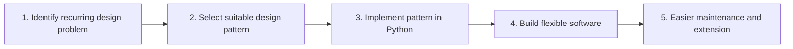

**Q2. Classify design patterns. Compare Creational, Structural and Behavioral patterns. When is each category used?**
•	Answer
The Gang of Four (GoF) classified design patterns into three major categories according to the kind of design problem they solve.
##### 1. Creational Patterns
Creational patterns focus on object creation.
Instead of creating objects directly throughout the program, these patterns centralize or control the creation process.
      -   Typical examples include:
      - Singleton 
      - Factory Method 
      - Abstract Factory 
      - Builder 
      - Prototype 

These patterns are useful when object creation is complex or must follow specific rules.

•	2. Structural Patterns
Structural patterns focus on how objects are combined to form larger structures.
They simplify relationships among classes while keeping the system flexible.
Examples include:

  -    Decorator 
-    Adapter 
-    Facade 
-    Composite 
-    Proxy 

These patterns help build larger systems from smaller, reusable components.

•	3. Behavioral Patterns
Behavioral patterns focus on communication between objects.
They define how objects exchange information and responsibilities.
Examples include:
-    Observer 
-    Strategy 
-    Command 
-    Iterator 
-    Template Method 

These patterns improve flexibility by separating behaviour from the objects that use it.
________________________________________
| Category | Main Focus | Typical Question Answered |
| --- | --- | --- |
| Creational | Creating objects | How should objects be created? |
| Structural | Organizing objects | How should objects be connected? |
| Behavioral | Object communication | How should objects interact? |
________________________________________
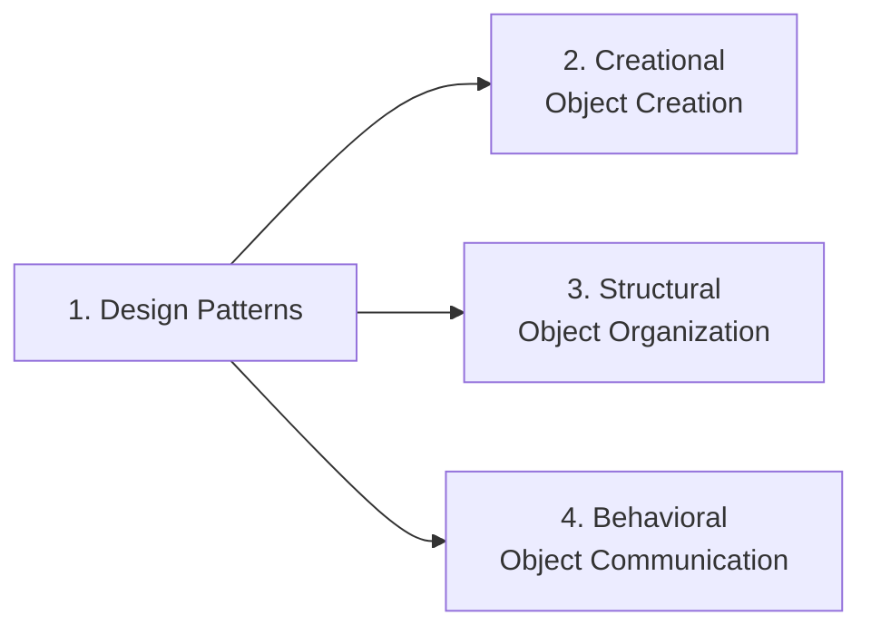
________________________________________
**Q3. Explain the Factory Method Pattern. What problem does it solve? How does it improve software compared to directly creating objects?**
•	Answer
The Factory Method pattern centralizes object creation inside a factory method instead of allowing client code to directly create objects.
Without a factory, a program may contain many statements such as:
`report = PDFReport()`
If the report type changes later, every such statement may have to be modified.
With the Factory Method pattern, the client asks a factory to create the required object.
`report = factory.create_report()`
The client does not need to know the exact class being created.
This separation makes the program easier to modify because changes are confined to the factory rather than scattered throughout the application.
The Factory Method pattern also follows the principle of encapsulation by hiding the object creation logic from the client.
________________________________________
•	Advantages
•	centralizes object creation; 
•	reduces duplicate code; 
•	hides implementation details; 
•	simplifies future modifications; 
•	improves maintainability. 
________________________________________
•	Comparison
| Without Factory Method | With Factory Method |
| --- | --- |
| Client creates objects directly | Factory creates objects |
| Changes affect many locations | Changes usually affect only the factory |
| Strong coupling | Loose coupling |
________________________________________
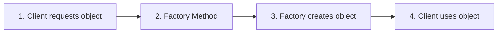

________________________________________
**Q4. Compare the Singleton and Factory Method patterns. When should each be preferred?**
•	Answer
Although both patterns deal with object creation, they solve different problems.
The Singleton pattern ensures that only one instance of a class exists throughout the program.
Examples include:
•	application configuration; 
•	logging system; 
•	printer manager. 
The Factory Method pattern decides which object should be created.
It does not restrict the number of objects.
For example, a report factory may create:
•	PDF reports; 
•	Excel reports; 
•	HTML reports. 
Each request may create a new object.
Thus:
•	Singleton answers "How many objects should exist?" 
•	Factory Method answers "Which object should be created?" 
These are completely different design goals.
________________________________________
•	Comparison Table
| Singleton | Factory Method |
| --- | --- |
| One instance | Many instances possible |
| Controls quantity | Controls object creation |
| Same object reused | New objects may be created |
| Useful for shared resources | Useful for flexible object creation |
________________________________________
Flowchart

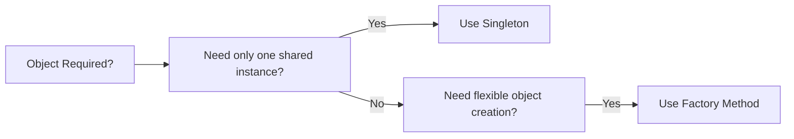
________________________________________
**Q5. Explain the Decorator Pattern. How does it differ from inheritance? Why are Python decorators considered a Pythonic alternative?**
Answer
The Decorator pattern allows new functionality to be added to an existing object without modifying its original class.
Instead of changing the class itself, another object wraps the original object and adds additional behaviour.
For example, a greeting function may simply return a user's name.
A decorator can add:
•	logging; 
•	timing; 
•	authentication; 
•	formatting. 
The original function remains unchanged.
Unlike inheritance, decorators allow behaviour to be added dynamically at runtime.
Inheritance creates a new subclass.
Decoration wraps an existing object.
Python makes this pattern especially convenient through the `@decorator` syntax.
Instead of writing separate wrapper classes as is common in languages such as Java or C++, Python allows programmers to decorate functions directly.
This results in shorter, cleaner, and more readable code.
________________________________________
•	Comparison Table
| Inheritance | Decorator |
| --- | --- |
| Creates new subclass | Wraps existing object/function |
| Changes class hierarchy | Adds behaviour dynamically |
| Static relationship | Runtime enhancement |
| Less flexible | More flexible |
________________________________________
Flowchart

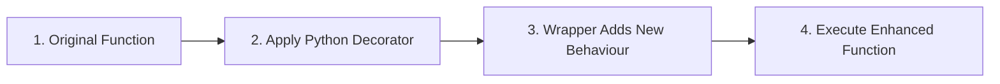

**Q6. Explain the Abstract Factory Pattern. What problem does it solve? How does it ensure that related objects are created together?**

Answer
The Abstract Factory pattern provides a way to create families of related objects without specifying their concrete classes. Unlike the Factory Method pattern, which typically creates a single object, the Abstract Factory creates multiple objects that are designed to work together.
Consider a graphical user interface (GUI) application. If the application is running on Windows, all interface elements should have the Windows look and feel. Similarly, if it is running on macOS, all interface elements should have the Mac appearance.
Instead of creating each object individually, the application asks a factory to create all the required objects. The factory ensures that every object belongs to the same family.
This prevents accidental mixing of incompatible objects and keeps the application's appearance and behaviour consistent.

Comparison Table

| Factory Method | Abstract Factory |
| --- | --- |
| Creates one object | Creates a family of related objects |
| Simpler | More comprehensive |
| Suitable for one product | Suitable for multiple related products |
| Example: Create a report | Example: Create a complete GUI |
________________________________________
Flowchart

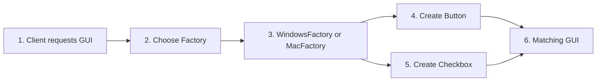
________________________________________
**Q7. Explain the Builder Pattern. Why is it preferred when constructing complex objects? Compare it with using a constructor having many parameters.**

Answer
The Builder pattern constructs a complex object step by step. Instead of supplying every value to a large constructor, the object is assembled gradually.
Suppose a Computer object contains many optional components such as RAM, SSD, processor, graphics card and operating system. A constructor with numerous parameters becomes difficult to read and use.
The Builder pattern solves this problem by allowing each component to be added separately. After all required components have been specified, the final object is constructed.
This improves readability because each construction step clearly describes what is being added. It also makes the code easier to modify, since optional components can be included or omitted without changing the constructor.
________________________________________
Comparison Table
| Large Constructor | Builder Pattern |
| --- | --- |
| Many parameters | Step-by-step construction |
| Difficult to read | Easy to understand |
| Hard to extend | Easy to add optional parts |
| Error-prone | More maintainable |
________________________________________
Flowchart

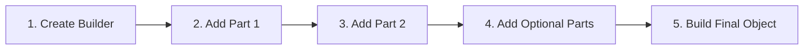

**Q8. Explain the Adapter Pattern. What problem does it solve? How does it help integrate incompatible classes?**

Answer
The Adapter pattern allows two incompatible classes to work together without modifying either of them.
Often, an application needs to use an existing class whose interface differs from what the application expects. Instead of rewriting the existing class, an adapter converts one interface into another.
For example, suppose an application expects every payment system to provide a method named pay(). A third-party payment library may instead provide a method called make_payment(). An adapter can translate calls to pay() into calls to make_payment().
The client code continues to use the expected interface without knowing that an adapter is performing the translation internally.
The Adapter pattern is widely used when integrating legacy software, third-party libraries, APIs and hardware drivers.
________________________________________
1.3.2 Comparison Table

| Without Adapter | With Adapter |
| --- | --- |
| Interfaces incompatible | Interfaces become compatible |
| Client must change | Client remains unchanged |
| Difficult integration | Easy integration |
| Tight coupling | Loose coupling |

________________________________________
Flowchart

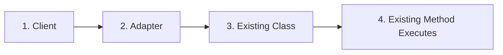
________________________________________
Q9. Explain the Facade Pattern. How does it simplify the use of complex subsystems? Give suitable situations where it is useful.

Answer
The Facade pattern provides a single, simple interface to a complex subsystem.
Large software systems often consist of many classes that must be called in a particular order. Requiring every programmer to remember this sequence increases complexity and the chance of errors.
A facade hides this complexity behind a single method or class. The client interacts only with the facade, while the facade internally coordinates all the necessary subsystem objects.
For example, starting a home theatre system may require switching on the television, sound system, streaming device and lighting. A HomeTheatreFacade can perform all these operations through a single method such as watch_movie().
The Facade pattern makes software easier to use, reduces coupling and improves maintainability.
________________________________________
1.4.2 Comparison Table
| Without Facade | With Facade |
| --- | --- |
| Many subsystem calls | One simple interface |
| Client manages sequence | Facade manages sequence |
| Complex client code | Cleaner client code |
| Strong coupling | Reduced coupling |

________________________________________
Flowchart
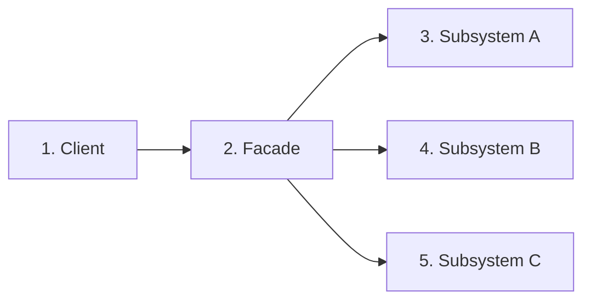
______________________________________
**Q10. Compare the Decorator, Adapter and Facade patterns. Although all are structural patterns, how do their purposes differ?**

Answer
Decorator, Adapter and Facade all belong to the Structural Design Pattern category because they organise relationships among objects. However, each addresses a different design problem.
The Decorator pattern adds new behaviour to an existing object without modifying its class.
The Adapter pattern changes the interface of an existing object so that it becomes compatible with another system.
The Facade pattern simplifies access to a complex subsystem by providing a single, easy-to-use interface.
Although these patterns all involve wrapping or connecting objects, their intentions are entirely different.
Choosing the correct pattern depends on the problem being solved rather than the implementation technique.
________________________________________
Comparison Table

| Pattern | Primary Purpose | Typical Use |
| --- | --- | --- |
| Decorator | Add behaviour | Logging, formatting, authentication |
| Adapter | Convert interface | Third-party libraries, legacy systems |
| Facade | Simplify subsystem | GUI, multimedia, database systems |

________________________________________
Flowchart

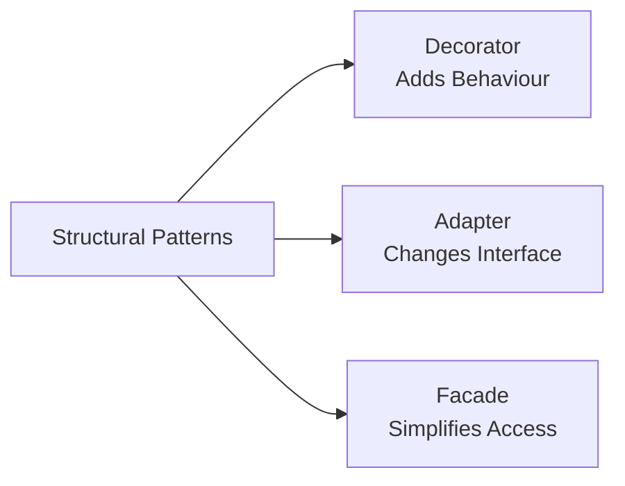
________________________________________

**Q11. Explain the Composite Pattern. What problem does it solve? How does it allow individual objects and groups of objects to be treated uniformly?**
•	Answer
The Composite Pattern allows individual objects and groups of objects to be treated in the same way. It organizes objects into a tree-like structure, where both individual objects (called leaf objects) and collections of objects (called composites) support the same operations.
Without this pattern, the client code would need separate logic to handle a single object and a collection of objects. This increases complexity and reduces code reusability.
For example, a company's organizational structure may contain employees as well as departments. A department can contain employees and even other departments. Using the Composite Pattern, both employees and departments can implement the same method, such as display().
The client simply calls the method without worrying whether it is working with a single object or an entire group.
The Composite Pattern is commonly used for:
•	file and directory systems; 
•	organization hierarchies; 
•	graphical user interface (GUI) components; 
•	menu structures. 
________________________________________
•	Comparison Table
| Without Composite | With Composite |
| --- | --- |
| Separate code for objects and groups | Same code handles both |
| More conditional statements | Uniform interface |
| Difficult hierarchy management | Easy recursive processing |
| Less flexible | Highly extensible |

________________________________________
Flowchart

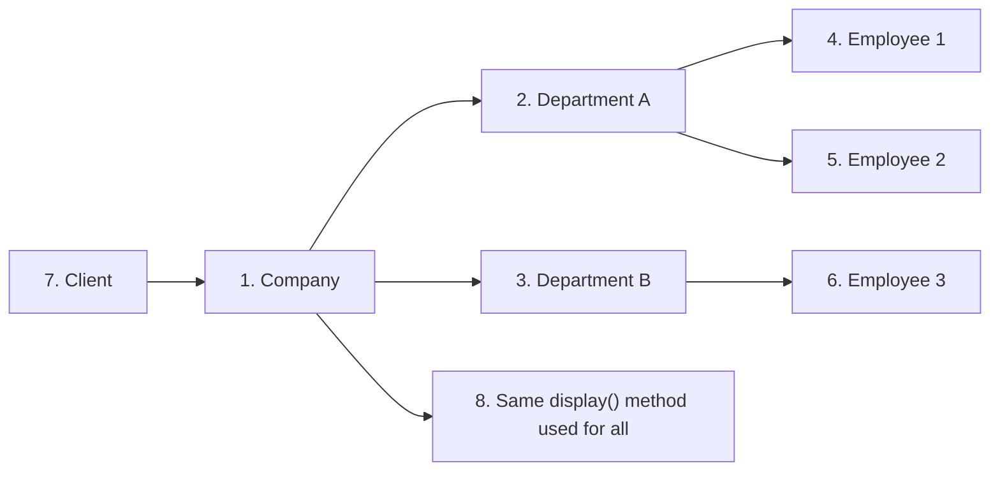

________________________________________
**Q12. Explain the Proxy Pattern. Why is it used? Compare it with directly accessing an object.**
•	Answer
The Proxy Pattern provides a substitute or placeholder for another object. Instead of allowing the client to communicate directly with the real object, all requests pass through the proxy.
The proxy can perform additional tasks before or after forwarding the request.
Typical responsibilities of a proxy include:
•	checking access permissions; 
•	delaying object creation until needed (lazy loading); 
•	logging operations; 
•	caching frequently used results; 
•	monitoring object usage. 
For example, suppose a large image requires significant memory to load. Instead of loading it immediately, a proxy object delays loading until the image is actually displayed.
The client continues to use the object in the same way, without knowing that a proxy is controlling access.
________________________________________
Comparison Table
| Direct Access | Proxy Pattern |
| --- | --- |
| Client accesses object directly | Client communicates through proxy |
| No additional control | Access can be controlled |
| Immediate object creation | Lazy loading possible |
| Less secure | Better security and monitoring |

________________________________________
Flowchart

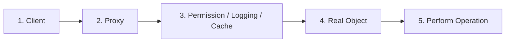

________________________________________
**Q13. Explain the Observer Pattern. How does it support communication between objects? Give suitable applications.**
•	Answer
The Observer Pattern establishes a one-to-many relationship between objects. When one object changes its state, all dependent objects are automatically notified.
The object being observed is called the Subject, while the objects receiving notifications are called Observers.
Instead of manually informing every object about a change, the subject automatically broadcasts notifications to all registered observers.
A common example is a weather station. Whenever the temperature changes, all subscribed displays receive the updated information automatically.
Similarly, graphical user interfaces use this pattern extensively. When a user clicks a button, multiple components may react simultaneously.
The Observer Pattern reduces coupling because the subject does not need to know the internal details of the observers.
________________________________________
•	Comparison Table

| Without Observer | With Observer |
| --- | --- |
| Manual notifications | Automatic notifications |
| Tight coupling | Loose coupling |
| Difficult to add listeners | Easy to register new observers |
| More maintenance | Better extensibility |

________________________________________
Flowchart
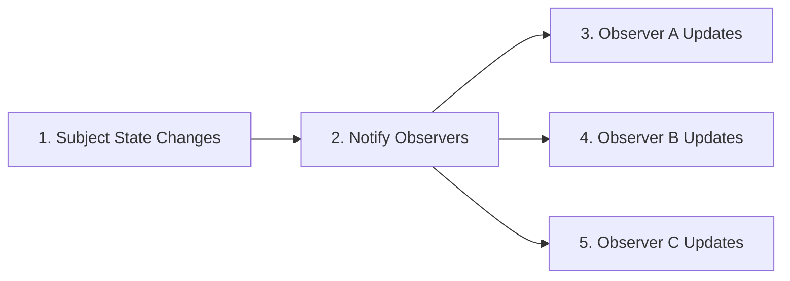

________________________________________
**Q14. Explain the Strategy Pattern. How does it allow algorithms to be changed at runtime? Compare it with using large if-elif statements.**
•	Answer
The Strategy Pattern allows different algorithms to be encapsulated inside separate classes or functions. The client selects the required strategy at runtime.
Without the Strategy Pattern, programmers often write large if-elif blocks to choose among several algorithms. Such code becomes difficult to read and maintain as the number of choices increases.
With the Strategy Pattern, each algorithm is implemented independently. The client simply chooses the required strategy.
For example, an online shopping application may support multiple payment methods:
•	Credit Card 
•	UPI 
•	Net Banking 
•	Digital Wallet 
Each payment method becomes a separate strategy.
Adding another payment option usually requires creating only one new strategy rather than modifying existing code.
________________________________________
•	Comparison Table

| Large if-elif | Strategy Pattern |
| --- | --- |
| Long conditional statements | Independent strategies |
| Difficult to extend | Easy to add new strategies |
| More code modification | Minimal changes |
| Less maintainable | More maintainable |

________________________________________
Flowchart
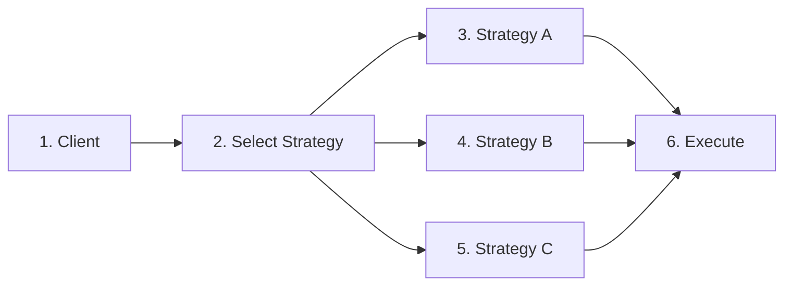
________________________________________
**Q15. Explain the Command Pattern. How does it help in implementing undo operations, menus and task queues?**
•	Answer
The Command Pattern converts a request into an object. Instead of directly performing an operation, the request is stored inside a command object.
Each command object contains all the information required to perform the requested action.
For example, in a text editor, clicking the Copy, Paste, or Undo buttons creates corresponding command objects. The application executes these commands whenever required.
Since commands are ordinary objects, they can be:
•	stored in a list; 
•	executed later; 
•	repeated; 
•	logged; 
•	undone. 
The Command Pattern separates the object requesting an operation from the object performing it.
This makes the application more flexible and simplifies features such as menus, toolbars, macros and undo-redo functionality.
________________________________________
•	Comparison Table

| Direct Method Call | Command Pattern |
| --- | --- |
| Immediate execution | Request stored as object |
| Difficult to implement undo | Undo becomes easier |
| Less flexible | More flexible |
| Tight coupling | Loose coupling |

________________________________________
Flowchart

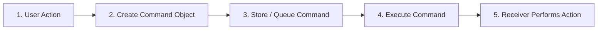
________________________________________
.
**Q16. Explain the Iterator and Template Method patterns. What problems do they solve? Compare their purposes and typical applications.**
Answer
The Iterator and Template Method patterns are both behavioral design patterns, but they address different kinds of problems.
The Iterator Pattern provides a standard way to access the elements of a collection one at a time without exposing its internal implementation. Whether the collection is a list, tuple, set or a custom data structure, the client can traverse it using the same basic approach.
In Python, many built-in objects such as list, tuple, set, dict and str already support iteration using the for loop. This makes the Iterator pattern feel natural in Python.
The Template Method Pattern defines the overall structure (or skeleton) of an algorithm while allowing certain individual steps to be implemented differently by subclasses.
For example, different report generators may all follow these steps:

 - Read data. 
 - Process data. 
 - Generate report. 
 - Save report
 
The overall sequence remains the same, while subclasses customize only specific steps.
Thus, the Iterator pattern focuses on accessing data, whereas the Template Method pattern focuses on organizing algorithms.
________________________________________
Comparison Table

| Iterator Pattern | Template Method Pattern |
| --- | --- |
| Traverses collections | Organizes algorithms |
| Focuses on accessing data | Focuses on execution steps |
| Hides collection implementation | Hides algorithm structure |
| Common in loops | Common in frameworks |

________________________________________
Flowchart

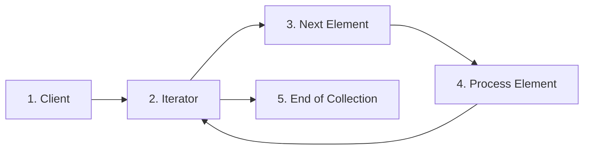

________________________________________
**Q17. Explain Pythonic Design Patterns. How do Python features such as decorators, context managers, mixins, duck typing and dataclasses simplify classical design patterns?**
Answer
Many classical design patterns were originally developed for languages such as C++ and Java, where the language itself provided fewer high-level features.
Python includes many language features that naturally support the same design goals with much less code. These are often referred to as Pythonic patterns.
For example:
•	Python decorators simplify the classical Decorator pattern. 
•	Context managers simplify resource management. 
•	Mixins allow behaviour to be added through multiple inheritance. 
•	Duck typing removes the need for rigid interface hierarchies in many situations. 
•	Dataclasses and named tuples provide lightweight value objects with minimal code. 
These language features reduce boilerplate code while making programs easier to read and maintain.
Python programmers therefore often prefer the Pythonic solution whenever it adequately solves the problem.
________________________________________
Comparison Table
| Classical GoF Approach | Pythonic Approach |
| --- | --- |
| Wrapper classes | Decorators |
| Explicit resource cleanup | with statement |
| Large inheritance hierarchies | Mixins |
| Formal interfaces | Duck typing |
| Verbose data classes | @dataclass, NamedTuple |

________________________________________
Flowchart

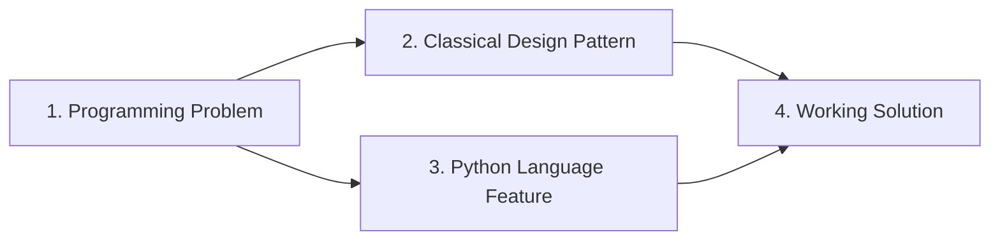

________________________________________
Q18. How should a programmer choose the appropriate design pattern? What factors should be considered before applying one?
Answer
Selecting the correct design pattern is one of the most important software design decisions. No single pattern is suitable for every problem.
A programmer should first understand the nature of the problem before selecting a pattern.
Some useful questions include:
•	Is the problem related to object creation? 
•	Is it related to object organization? 
•	Is it related to communication between objects? 
•	Can Python's built-in features solve the problem more simply? 
Choosing an unnecessarily complex pattern may make the program harder to understand.
A good programmer first attempts the simplest solution and introduces a design pattern only when it clearly improves the software.
Understanding the purpose of each pattern is therefore more important than memorizing its implementation.
________________________________________
Decision Guide
| Problem | Suitable Pattern |
| --- | --- |
| Flexible object creation | Factory Method |
| Family of related objects | Abstract Factory |
| Add behaviour | Decorator |
| Simplify subsystem | Facade |
| Multiple algorithms | Strategy |
| Event notification | Observer |

________________________________________
Flowchart

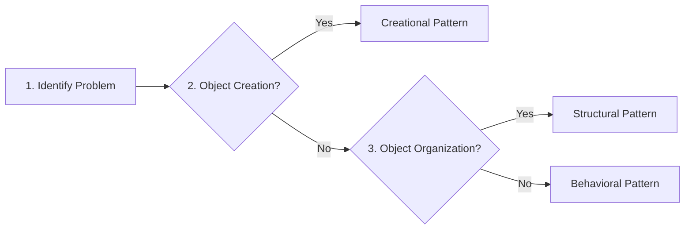

________________________________________
Q19. Why are multiple design patterns sometimes combined in a single application? Explain with suitable examples.
Answer
Large software systems often solve many different design problems simultaneously. As a result, a single design pattern is usually insufficient.
Instead, multiple patterns are combined, with each pattern solving a specific aspect of the overall problem.
For example, a graphical application may use:
•	Factory Method to create windows. 
•	Observer to update the user interface. 
•	Strategy to select different sorting algorithms. 
•	Decorator to add logging. 
•	Facade to simplify subsystem interaction. 
Each pattern performs a different responsibility while cooperating with the others.
This modular approach produces software that is easier to maintain, extend and test.
However, programmers should combine patterns only when necessary. Using too many patterns can make the software unnecessarily complicated.
________________________________________
Example Combination

| Requirement | Pattern Used |
| --- | --- |
| Create interface components | Factory Method |
| Notify display changes | Observer |
| Select algorithm | Strategy |
| Add logging | Decorator |
| Simplify subsystem | Facade |

________________________________________
Flowchart

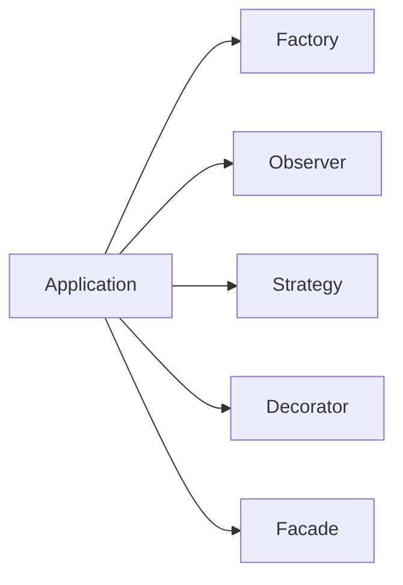
________________________________________

Q20. What are anti-patterns? Explain common design-pattern mistakes such as over-engineering, God Object and cargo-cult programming. How can they be avoided?

Answer
An anti-pattern is a commonly used solution that appears useful but ultimately leads to poor software design.
One common mistake is over-engineering, where programmers introduce unnecessary classes, factories and abstractions for very simple problems. This increases complexity without providing significant benefits.
Another common anti-pattern is the God Object. In this situation, a single class performs too many responsibilities, such as data storage, business logic, user interface management, database access and logging. Such classes become difficult to understand, test and maintain.
A third mistake is cargo-cult programming, where programmers copy design patterns from books or the Internet without understanding why they are being used. The result is complicated software that solves no real problem.
Good software design follows the principle of simplicity. A design pattern should be introduced only when it genuinely improves the program.
Remember the following guideline:
Use a design pattern because the problem requires it—not because the pattern exists.
________________________________________
Comparison Table
| Anti-pattern | Problem Created | Better Practice |
| --- | --- | --- |
| Over-engineering | Unnecessary complexity | Prefer simple solutions |
| God Object | Too many responsibilities | Divide responsibilities among classes |
| Cargo-cult programming | Blindly copying patterns | Understand the problem first |

________________________________________
Flowchart

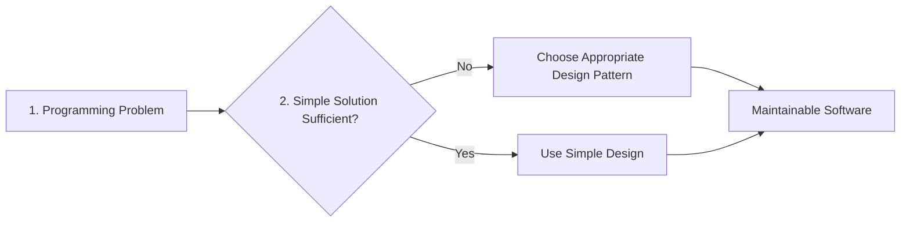

