**Question 1. Strings: Built-in type, sequence, ordered collection, characteristics. Why are strings called sequence types? Compare briefly with a set.**

**Answer**

A **string** is one of Python's **built-in data types**. A built-in type is one that is provided by the Python language itself, so programmers can use it immediately without importing any module or writing their own implementation.

A string represents a sequence of characters. Each character occupies a definite position within the sequence. Because every character has a fixed position, Python allows us to access any character using its index.

One of the most important properties of a string is that it is an **ordered collection**. In an ordered collection, the arrangement of elements is preserved.

For example,

`word = "Python"`

contains the characters in the following order:

| **Index** | **Character** |
| --- | --- |
| 0 | P |
| 1 | y |
| 2 | t |
| 3 | h |
| 4 | o |
| 5 | n |

If we rearrange these characters,

`"Python"`

becomes

`"nohtyP"`

which is an entirely different string.

This is unlike a **set**.

`{'a','b','c'}`

and

`{'c','a','b'}`

represent exactly the same set because sets are **unordered collections**.

**Comparison**

| **String** | **Set** |
| --- | --- |
| Ordered collection | Unordered collection |
| Duplicate characters allowed | Duplicate elements removed |
| Indexed | Not indexed |
| Supports slicing | Does not support slicing |
| Immutable | Mutable (normal sets) |

**Why sequence?**

A data type is called a **sequence** when

-   every element occupies a definite position,
-   elements can be accessed using indexes,
-   the order is preserved,
-   iteration proceeds from beginning to end.

Strings satisfy all these properties.

**Example**

```python
s = "Computer"
print(s[0])
print(s[3])
for ch in s:
    print(ch)
```

**Key points**

-   String is a built-in type.
-   String is a sequence.
-   Strings are ordered collections.
-   Characters have fixed positions.
-   Strings support indexing and slicing.

**Question 2. Creating strings: Single, double, triple quotes. Multi-line strings vs docstrings. When should each be used?**

**Answer**

Python provides multiple ways to create string objects.

All the following statements create valid strings.

```python
a = 'Python'
b = "Python"
c = '''Python'''
d = """Python"""
```

Although these look different, they all create objects of type str.

The difference lies mainly in **how they are used** rather than in the object created.

**Single quotes**

Usually used for short strings.

`city = 'Delhi'`

**Double quotes**

Useful when the string itself contains single quotes.

`sentence = "It's raining."`

Without double quotes, the apostrophe would have to be escaped.

**Triple quotes**

Triple quotes allow a string to span multiple lines.

Example

```python
address = """
New Delhi
India
110001
"""
```

Everything including newlines becomes part of the string.

**Docstrings**

Triple quotes have another important purpose.

When a triple-quoted string appears as the **first statement** inside a

-   module
-   class
-   function

Python treats it as a **documentation string (docstring)**.

Example

```python
def area(radius):
    """
    Calculates the area of a circle.
    """
    return 3.14159 \* radius \* radius
```

Many IDEs automatically display this documentation.

**Multi-line string vs Docstring**

| **Multi-line String** | **Docstring** |
| --- | --- |
| Stores text | Stores documentation |
| Can appear anywhere | Must appear as first statement |
| Used as data | Used by documentation tools |
| Ordinary string | Special documentation convention |

**Example**

```python
def greet():

    """
    Greets the user.
    """
    print("Hello")
```
The string is not printed.

Instead, it becomes the function's documentation.
`print(greet.__doc__)`
prints
`Greets the user.`

**Key points**

-   Single and double quotes create ordinary strings.
-   Triple quotes allow multi-line strings.
-   Triple quotes also create docstrings.
-   Docstrings improve documentation and readability.

**Question 3. `str()` and string representation. What is meant by the string representation of an object? Why is `str()` useful?**

**Answer**

In Python, **everything is an object**. Integers, floating-point numbers, Boolean values, lists, tuples, dictionaries, and even functions are objects.

Whenever Python needs to display one of these objects as text, it creates a **string representation** of that object.

The built-in function

`str()`
returns this representation.
For example,
```python
number = 125
text = str(number)
```
Here, `number` is an integer.
After applying `str(number)` the result becomes `"125"` which is a string.

**Examples**
```python
print(str(15))  # "15"
print(str(3.14))  # "3.14"
print(str(True))  # "True"
print(str(None))  # "None"
print(str([1,2,3]))  # "[1,2,3]"
```

Notice that every object has its own textual representation.

**Why is this useful?**
One common application is string concatenation.

```python
age = 25
print("Age = " + str(age))
```
Without conversion, `"Age = " + age` raises `TypeError` because Python cannot concatenate a string with an integer.

**Common applications**

-   displaying numbers
-   preparing reports
-   writing files
-   creating log messages
-   building formatted strings

**Summary table**

| **Object** | **str() Result** |
| --- | --- |
| 25 | "25" |
| 3.14 | "3.14" |
| True | "True" |
| None | "None" |
| \[1,2\] | "\[1, 2\]" |

**Key points**

-   str() converts objects into strings.
-   Every Python object has a string representation.
-   It is widely used for printing and formatting output.

**Question 4. String indexing: Positive and negative indexing. Why does Python support negative indexing? Explain the indexing rules.**

**Answer**

A string consists of characters arranged sequentially.

Each character has a unique position called its **index**.

Python supports two indexing systems.

-   Positive indexing
-   Negative indexing

Consider

`word = "Python"`

| **Character** | **P** | **y** | **t** | **h** | **o** | **n** |
| --- | --- | --- | --- | --- | --- | --- |
| Positive Index | 0 | 1 | 2 | 3 | 4 | 5 |
| Negative Index | \-6 | \-5 | \-4 | \-3 | \-2 | \-1 |

Positive indexing starts from the beginning.

Negative indexing starts from the end.

Therefore, `word[-1]` returns `n`
while `word[-2]` returns `o`

**Why negative indexing?**

Suppose we want the last character.

Without negative indexing we must write

word\[len(word)-1\]

With negative indexing, `word[-1]` is much simpler.

This makes many algorithms easier to write.

**Rules**

1.  First character has index 0.
2.  Last character has index -1.
3.  Positive indexing proceeds left to right.
4.  Negative indexing proceeds right to left.
5.  Accessing an invalid index raises IndexError.

Example

```python
word = "Python"
print(word[0\)
print(word[-1])
print(word[100])
```
The last statement produces  `IndexError`

**Diagram**

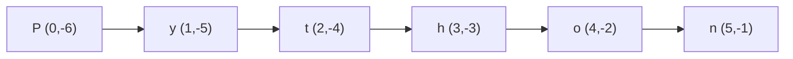

**Key points**

-   Strings support positive and negative indexing.
-   Positive indexing starts at zero.
-   Negative indexing starts at minus one.
-   Invalid indexes raise IndexError.

**Question 5. String immutability. What does immutable mean? Why are Python strings immutable? How can a string be 'modified' if it cannot be changed?**

**Answer**

One of the defining characteristics of Python strings is that they are **immutable**.

An immutable object cannot be changed after it has been created.

Consider

`name = "Python"`
The following statement is illegal.
`name[0] = 'J'`

Python immediately reports: `TypeError` because individual characters of a string cannot be modified.

Instead of changing the existing string, Python creates a **new string** whenever a modification appears to occur.

For example,
```python
name = "Python"
new_name = name.replace("P", "J")
```
Now
`name` still contains `Python` while `new_name` contains `
Jython`

The original object has not changed.

**Why make strings immutable?**

Immutability provides several advantages.

-   It prevents accidental modification.
-   It makes strings safer to share between different parts of a program.
-   It simplifies memory management.
-   It allows Python to optimize storage and performance.
-   It enables strings to be used as dictionary keys because their values cannot change.

**Comparison**

| **Mutable Object** | **Immutable Object** |
| --- | --- |
| List | String |
| Dictionary | Tuple |
| Set | Integer |

**Demonstration**
```python
text = "Hello"
new\_text = text.upper()
print(text)
print(new\_text)
# Output
# Hello
# HELLO
```
Notice that upper() returned a **new string** while leaving the original unchanged.

**Conceptual flow**
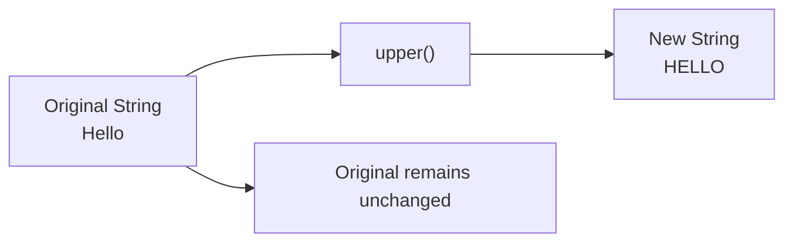


**Key points**

-   Strings are immutable.
-   Characters cannot be changed individually.
-   String methods usually return new string objects.
-   The original string remains unchanged unless the returned value is assigned to a variable.
-   Immutability improves safety, reliability, and efficiency.


**Question 6. Escape sequences. Why are they needed? Explain common escape sequences with suitable examples.**

**Answer**

When Python encounters a string enclosed within quotes, it normally treats every character literally. However, some characters such as a **new line**, **tab**, or **quotation mark inside a string** cannot be typed directly without causing ambiguity. To represent such special characters, Python uses **escape sequences**.

An escape sequence always begins with a **backslash (\\)** followed by another character. The backslash informs the Python interpreter that the following character should receive a special interpretation rather than being treated as an ordinary character.

For example, in the string
`print("Hello\nWorld")`

the sequence \n does not represent two characters (\ and n). Instead, it represents a **newline character**, causing the output to appear on two separate lines.

Similarly,
`print("Hello\tWorld")`
uses `\t` to insert a horizontal tab.

Escape sequences make it possible to include otherwise difficult-to-type characters inside string literals while keeping programs readable and portable.

**Common escape sequences**

| **Escape Sequence** | **Meaning** | **Example** |
| --- | --- | --- |
| \\ | Backslash | "C:\\Users" |
| \' | Single quote | 'It\'s raining' |
| \" | Double quote | "He said \"Hello\"" |
| \n | New line | "A\nB" |
| \t | Horizontal tab | "A\tB" |
| \r | Carriage return | "ABC\rXY" |
| \b | Backspace | "ABC\bD" |
| \uXXXX | Unicode character | "\u03A9" |

**Example**
```python
print("First Line\\nSecond Line")
print("Name\\tAge")
print("He said \\"Python is easy\\"")
print("It's a beautiful day.")
print("Folder: C:\\\\Python\\\\Scripts")
```
Output
```python
First Line
Second Line
Name Age
He said "Python is easy"
It's a beautiful day.
Folder: C:\\Python\\Scripts
```

**Why not type the characters directly?**

Many special characters cannot be represented directly inside a string.

For example, `print("He said "Hello"")` is syntactically incorrect because Python interprets the second quotation mark as the end of the string.

Instead, `print("He said \"Hello\"")` correctly escapes the quotation marks.

**Flowchart**
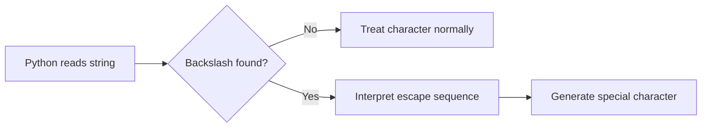

**Common beginner mistakes**

| **Mistake** | **Result** |
| --- | --- |
| Forgetting \ before quotes | SyntaxError |
| Writing Windows paths without escaping \\ | Unexpected escape sequences |
| Assuming \n is printed literally | Actually creates a new line |
| Using unknown escape sequences | May produce warnings or incorrect output |

**Key Points**

-   Escape sequences begin with a backslash.
-   They represent special characters.
-   They improve readability.
-   They allow quotation marks and special symbols inside strings.
-   They are interpreted by Python before the string is stored.

**Question 7. Raw strings. Why are they needed? Compare raw strings with ordinary strings. Give typical applications.**

**Answer**

Normally, Python treats every backslash (\) inside a string as the beginning of an escape sequence. However, in many practical applications we do **not** want this behaviour. Instead, we want every backslash to be treated as an ordinary character.

A **raw string** solves this problem.

A raw string is created by placing the letter r (or R) immediately before the opening quotation mark.
`path = r"C:\Users\Student\Documents"`
Here Python stores every backslash exactly as written.
**Ordinary string**
`path = "C:\new\test"`
Python interprets `\n` as a newline and `\t` as a tab.

Consequently the string stored in memory is **not** what the programmer intended.

**Raw string**

`path = r"C:\new\test"`

Now every backslash remains unchanged.

**Comparison**

| **Ordinary String** | **Raw String** |
| --- | --- |
| Escape sequences interpreted | Escape sequences ignored |
| \n becomes newline | \n remains two characters |
| \t becomes tab | \t remains literal |
| Suitable for ordinary text | Suitable for file paths and regular expressions |

**Example**
```python
normal = "C:\new\test"
raw = r"C:\new\test"
print(normal)
print(raw)
```
Output
```python
C:
ew est
C:\new\test
```

Notice how the normal string has been modified because Python interpreted \\n and \\t.

**Typical applications**

Raw strings are commonly used for

-   Windows file paths `r"C:\Program Files\Python"`
-   Regular expressions `r"\d+\w+"`
-   Network paths
-   Mathematical patterns
-   Text containing many backslashes

**Diagram**
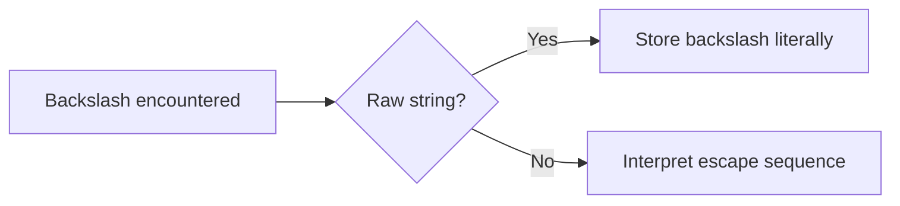

**Common beginner mistakes**

| **Mistake** | **Explanation** |
| --- | --- |
| Forgetting the `r` prefix | Escape sequences are interpreted |
| Assuming raw strings change the contents | They only change how Python interprets backslashes |
| Using raw strings unnecessarily | Ordinary strings are sufficient in most cases |

**Key Points**

-   Raw strings begin with r.
-   Backslashes lose their special meaning.
-   Widely used for Windows paths and regular expressions.
-   Improve readability.
-   Prevent accidental escape sequence interpretation.

**Question 8. String traversal. Compare for loop and while loop traversal. When should each be preferred?**

**Answer**

**Traversing** a string means visiting each character in the string one after another.

Traversal is one of the most common operations performed on strings. Many algorithms such as searching, counting vowels, checking palindromes, encryption, validation, and frequency analysis require examining each character individually.

Python provides two common methods of traversal.

-   for loop
-   while loop

**Method 1 — for loop**

The for loop is the most natural and Pythonic way to traverse a string.
```python
message = "Python"
for ch in message:
    print(ch)
```
Python automatically extracts each character.
No index variable is needed.

**Method 2 — while loop**

The while loop traverses using indexes.
```python
message = "Python"
i = 0
    while i < len(message):
    print(message[i])
    i += 1
```
Here the programmer manually controls the index.

**Comparison**

| **Feature** | **for Loop** | **while Loop** |
| --- | --- | --- |
| Simplicity | Very simple | More complex |
| Index available automatically | No | Yes |
| Risk of infinite loop | None | Possible |
| Manual counter required | No | Yes |
| Preferred for normal traversal | Yes | No |
| Best for skipping or jumping indexes | Limited | Excellent |

**When should each be used?**

Use a **for loop** when

-   simply printing characters
-   counting vowels
-   searching
-   computing frequencies

Use a **while loop** when

-   indexes are important
-   adjacent characters must be compared
-   skipping characters dynamically
-   implementing certain algorithms

For example, palindrome algorithms often compare
```python
s[i]
```
with 
```python
s[-(i+1)]
```
which naturally uses indexes.

**Example**
```python
text = "Programming"
count = 0
for ch in text:
    if ch.lower() in "aeiou":
    count += 1

print(count)
```
The same algorithm can also be implemented using a while loop.

**Flowchart**
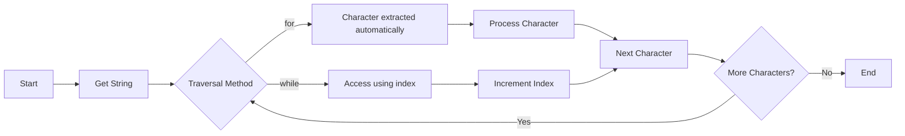
**Common beginner mistakes**

| **Mistake** | **Consequence** |
| --- | --- |
| Forgetting i += 1 | Infinite loop |
| Using <= len(s) | IndexError |
| Confusing character with index | Incorrect logic |
| Using while when for is sufficient | More complicated code |

**Key Points**

-   Traversal means visiting every character.
-   for loops are the preferred Pythonic approach.
-   while loops provide greater control.
-   Index-based traversal is useful for algorithms requiring character positions.
-   Both techniques ultimately examine the same sequence but offer different levels of control.


**Question 9. String operations. Explain concatenation, repetition, membership (in, not in). Distinguish between creating new strings and modifying existing ones.**

**Answer**

Python supports several built-in operators that work directly with strings. Unlike arithmetic operators, these operators manipulate textual data. Since strings are **immutable**, none of these operations modify the original string. Instead, every operation produces a **new string** or a **Boolean result**.

The most frequently used string operators are:

-   Concatenation (+)
-   Repetition (\*)
-   Membership (in)
-   Non-membership (not in)

Understanding these operators is essential because they form the basis of many text-processing algorithms.

**1\. Concatenation (+)**

The + operator joins two or more strings together.
```python
first = "Hello"
second = "World"
result = first + " " + second
print(result)
```
Output
```python
Hello World
```
Notice that neither first nor second changes. Python creates an entirely **new string** called result.

**2\. Repetition (\*)**

The * operator repeats a string multiple times.
```python
print("*" * 20)
print("Hi " * 3)
```
Output
```python
********************
Hi Hi Hi
```
This operator is commonly used for decorative separators, menus, reports, and test data.

**3\. Membership (in)**

The in operator checks whether a character or substring exists inside another string.
```python
language = "Python"
print("th" in language)
print("Java" in language)
```
Output
```python
True
False
```
The operator returns a Boolean value.

**4. Non-membership (not in)**

The opposite test uses not in.

`print("Java" not in language)`

Output
`True`

**Summary Table**

| **Operator** | **Purpose** | **Returns** |
| --- | --- | --- |
| + | Concatenation | New string |
| \* | Repetition | New string |
| in | Membership test | True or False |
| not in | Non-membership test | True or False |

**Do these operators modify the original string?**

No.

This is an important consequence of **immutability**.

Consider
```python
s = "Python"
t = s + " Programming"
print(s)
print(t)
```
Output
```python
Python
Python Programming
```
The original string remains unchanged.

**Real-world applications**

Concatenation is commonly used for

-   building messages
-   generating filenames
-   creating URLs
-   constructing reports

Repetition is useful for

-   menus
-   decorative borders
-   repeated patterns
-   testing

Membership testing is used for

-   searching keywords
-   validating input
-   checking file extensions
-   detecting prohibited words

**Flowchart**
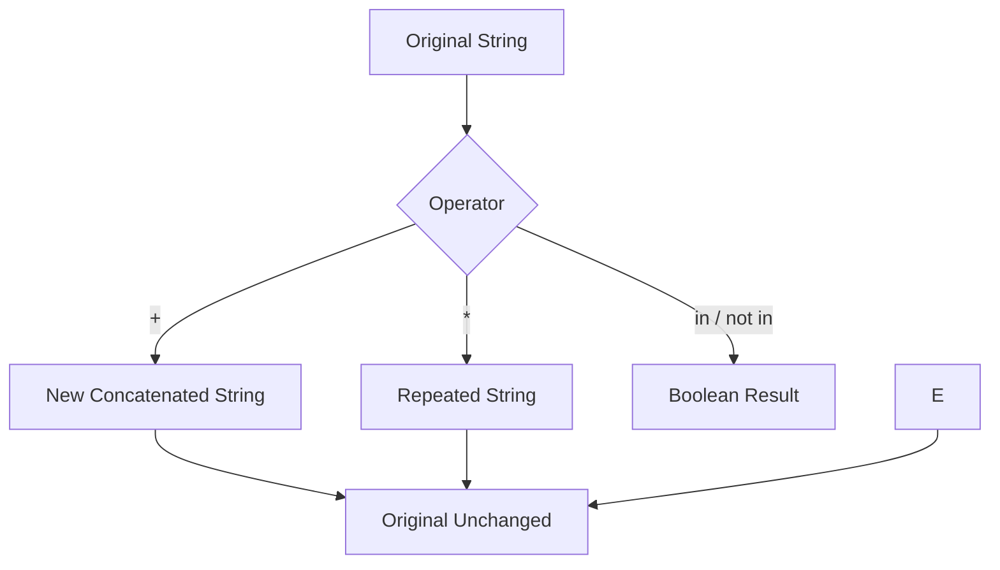
**Common beginner mistakes**

| **Mistake** | **Explanation** |
| --- | --- |
| Concatenating string with integer | Use str() or an f-string |
| Expecting + to modify the original string | It returns a new string |
| Confusing in with equality (==) | in searches for containment, not equality |
| Forgetting spaces while concatenating | "Hello"+"World" becomes "HelloWorld" |

**Key Points**

-   String operators never modify the original string.
-   \+ joins strings.
-   \* repeats strings.
-   in and not in perform membership tests.
-   Every operation either creates a new string or returns a Boolean value.

**Question 10. String slicing. Explain slicing syntax, omitted indices, negative slicing, step value, reversing a string, and common mistakes.**

**Answer**

**Slicing** is one of Python's most powerful sequence operations. It allows a programmer to extract a portion of a string without modifying the original string.

The general syntax is

`string[start : stop : step]`

All three components are optional.

**Components of slicing**

**Start**

The index from which extraction begins.

**Stop**

The position where extraction ends.

The stop index is **excluded**.

**Step**

Determines how many positions Python moves after selecting each character.

The default value is `1`

**Basic example**
```python
word = "Programming"
print(word[0:7])
```
Output
```python
Program
```
Python extracts characters beginning at index 0 and stops before index 7.

**Omitting parameters**

Python supplies default values whenever a parameter is omitted.
```python
word = "Programming"
print(word[:7])
print(word[3:])
print(word[:])
print(word[::2])
```
Output
```python
Program
gramming
Programming
Pormig
```

**Default values**

| **Slice** | **Meaning** |
| --- | --- |
| `[:stop]` | Start from beginning |
| `[start:]` | Continue until end |
| `[:]` | Copy entire string |
| `[::step]` | Traverse using given step |

**Negative indices**

Negative indexing counts from the end.
```python
text = "Python"
print(text[-4:-1])
```
Output
```python
tho
```
Negative slicing is especially useful when working near the end of long strings.

**Negative step**

A negative step moves through the string in the reverse direction.

The most famous example is
```python
text = "Python"
print(text\[::-1\])
```
Output
```python
nohtyP
Here
```
-   `start` defaults to the last character,
-   `stop` defaults to before the first character,
-   `step` is -1.

Python therefore visits every character from right to left.

**How Python processes a slice**

For `text[2:9:2]`

Python

1.  Starts at index 2
2.  Selects the character
3.  Moves forward two positions
4.  Repeats until the stop index is reached

**Flowchart**
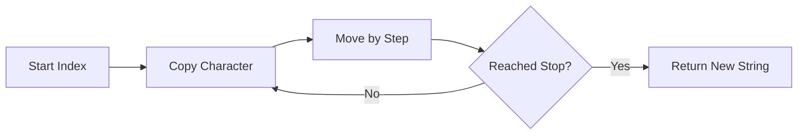
**Examples**
```python
text = "ABCDEFGHIJ"
print(text[2:8])
print(text[2:8:2])
print(text[::-1])
print(text[::3])
print(text[-5:-1])
```
Output
```python
CDEFGH
CEG
JIHGFEDCBA
ADGJ
FGHI
```
**Why slicing is useful**

Slicing is widely used for

-   extracting file extensions
-   processing substrings
-   reversing strings
-   implementing palindrome algorithms
-   parsing fixed-format records
-   selecting alternate characters

For example,
```python
filename = "report.pdf"
extension = filename\[-4:\]
```
returns

`.pdf`

without requiring loops.

**Common beginner mistakes**

| **Mistake** | **Explanation** |
| --- | --- |
| Assuming stop index is included | Python excludes the stop index |
| Confusing index with length | Last positive index is len(s)-1 |
| Using incorrect negative indices | Count backward carefully |
| Forgetting the step value | Default step is 1 |
| Assuming slicing modifies the original string | It always creates a new string |

**Slicing Summary Table**

| **Expression** | **Meaning** |
| --- | --- |
| s[:] | Complete copy |
| s[:5] | First five characters |
| s[5:] | Characters from index 5 onward |
| s[::2] | Every second character |
| s[::-1] | Reverse the string |
| s[-3:] | Last three characters |
| s[:-1] | All except the last character |
| s[1:-1] | Exclude first and last characters |

**Relationship with Immutability**

It is important to remember that slicing **never changes** the original string.
```python
text = "Python"
copy = text[2:5]
print(text)
print(copy)
```
Output
```python
Python
tho
```
The original string remains unchanged because slicing creates a **new string object**.

**Key Points**

-   Slicing extracts part of a string using the syntax `string[start:stop:step]`.
-   The **start index is included**, but the **stop index is excluded**.
-   Omitting indices causes Python to use sensible defaults.
-   A negative step traverses the string in reverse order.
-   The expression `s[::-1]` is a concise and Pythonic way to reverse a string.
-   Slicing always returns a **new string**, preserving the immutability of the original string.

Excellent. This continues naturally from Parts 1 and 2 and covers one of the most important conceptual sections of your chapter. As before, the **questions are intentionally brief** for the printed book, while the **answers are detailed** for GitHub.

**Question 11. ASCII, Unicode, `ord()`, `chr()`. Relationship? Why did Unicode replace ASCII? Explain with examples.**

**Answer**

Computers ultimately store and process everything as binary numbers. Therefore, before a computer can store a character such as 'A', '7', or '₹', it must assign a unique numeric value to that character. This mapping between characters and numbers is called a **character encoding**.

Over the years, two important encoding standards have been widely used:

-   ASCII (American Standard Code for Information Interchange)
-   Unicode

Unicode was developed to overcome the limitations of ASCII and has become the worldwide standard for representing text in modern computer systems.

**ASCII**

ASCII is one of the earliest character encoding standards.

It represents each character using **7 bits**, allowing only **128 unique characters**.

These include

-   English uppercase letters
-   English lowercase letters
-   Digits
-   Common punctuation symbols
-   Control characters

For example

| **Character** | **ASCII Code** |
| --- | --- |
| A | 65 |
| B | 66 |
| a | 97 |
| 0 | 48 |
| ! | 33 |

ASCII worked well for English but could not represent characters from most other languages.

**Why ASCII became insufficient**

As computers spread around the world, people needed to represent

-   Hindi
-   Chinese
-   Arabic
-   Japanese
-   Tamil
-   Russian
-   Mathematical symbols
-   Currency symbols
-   Emojis

ASCII simply did not have enough available codes.

For example,

₹ Ω 你 अ 😀

cannot be represented using standard ASCII.

**Unicode**

Unicode was designed to represent characters from **almost every writing system used in the world**.

Instead of supporting only 128 characters, Unicode currently defines well over one million possible code points, with more than 150,000 characters assigned.

Every character receives a unique **Unicode code point**.

Examples

| **Character** | **Unicode Code Point** |
| --- | --- |
| A | U+0041 |
| ₹ | U+20B9 |
| Ω | U+03A9 |
| अ | U+0905 |
| 😀 | U+1F600 |

Python 3 uses Unicode internally for all strings.

**`ord()`**

The built-in function
`ord(character)`
returns the Unicode code point of a character.

Example
```python
print(ord("A"))
print(ord("₹"))
print(ord("Ω"))
```
Output
```python
65
8377
937
```
**`chr()`**

The function

`chr(number)`

performs the opposite conversion.

It converts a Unicode code point into its corresponding character.

Example
```python
print(chr(65))
print(chr(8377))
print(chr(937))
```
Output
```python
A
₹
Ω
```
Thus,

-   `ord()` converts **character → integer**
-   `chr()` converts **integer → character**

**Relationship**

These functions are inverses of each other.
```python
x = "P"
print(chr(ord(x)))
```
Output
```python
P
```
Similarly,
```python
n = 9731
print(ord(chr(n)))
```
returns
`9731`

**Flowchart**
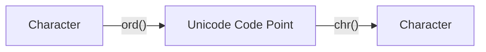
**Practical applications**

`ord()` and `chr()` are useful in

-   encryption algorithms
-   text processing
-   custom sorting
-   character arithmetic
-   encoding and decoding
-   generating alphabets programmatically

Example
```python
for code in range(ord('A'), ord('Z') + 1):  
    print(chr(code), end=" ")
```
Output
```python
A B C D E F G H I J K L M N O P Q R S T U V W X Y Z
```
**Comparison Table**

| **Feature** | **ASCII** | **Unicode** |
| --- | --- | --- |
| Characters supported | 128 | Over one million possible code points |
| Languages | Mostly English | Almost all languages |
| Emoji support | No | Yes |
| Currency symbols | Very limited | Extensive |
| Used by Python 3 | Only as a subset | Yes |

**Common beginner mistakes**

| **Mistake** | **Explanation** |
| --- | --- |
| Thinking ASCII and Unicode are identical | ASCII is only a small subset of Unicode |
| Using `ord()` on multiple characters | `ord()` accepts exactly one character |
| Passing an integer to `ord()` | It expects a string of length one |
| Passing a string to `chr()` | It expects an integer |

**Key Points**

-   ASCII is an older encoding standard with only 128 characters.
-   Unicode supports nearly all writing systems.
-   Python strings are Unicode strings.
-   `ord()` returns the Unicode code point.
-   `chr()` converts a code point back into a character.

**Question 12. String comparison. Equality vs lexicographical comparison. Role of Unicode values. Why is comparison case-sensitive?**

**Answer**

Python allows strings to be compared using comparison operators such as
```python
\==
!=
<
<=
>
>=
```
These comparisons are based on the Unicode values of individual characters.

There are two different kinds of comparison.

**Equality comparison**

The operator

`==` checks whether two strings contain exactly the same sequence of characters.

Example
```python
print("Python" == "Python")
print("Python" == "python")
```
Output
```python
True
False
```
Notice that uppercase **`P`** and lowercase **`p`** have different Unicode values.

**Lexicographical comparison**

Operators like
```python
<
>
<=
>=
```
perform dictionary-style comparisons.
Python compares the strings character by character.

Suppose we have
```python
"Apple"
"Application"
```
The first four characters match.

The comparison continues until a difference is found.
If one string ends first, the shorter matching string is considered smaller.

**Unicode ordering**

Python actually compares Unicode code points.
Example
```python
print(ord("A"))
print(ord("a"))
```
Output
```python
65
97
```
Since

`65 < 97`
Python concludes
`"A" < "a"`
is
`True`

**Example**
```python
print("Apple" < "Banana")
print("Zoo" > "Apple")
print("cat" > "Car")
```
**Why is comparison case-sensitive?**

Uppercase and lowercase letters occupy different Unicode positions.

Therefore
`print("Python" == "python")`
returns
`False`

**Case-insensitive comparison**

Convert both strings to the same case.
```python
name1 = "Python"
name2 = "python"
print(name1.lower() == name2.lower())
```
Output
`True`

**Flowchart**
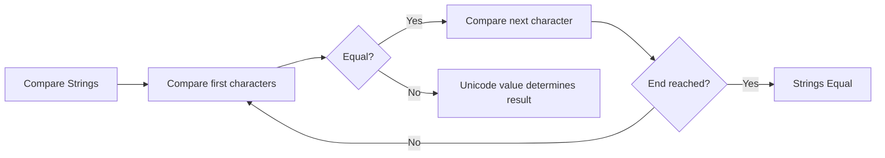
**Common beginner mistakes**

| **Mistake** | **Explanation** |
| --- | --- |
| Assuming dictionary order ignores case | Python compares Unicode values |
| Confusing equality with containment | "Py" is not equal to "Python" |
| Using is instead of == | is checks identity, not value |

**Key Points**

-   Equality checks exact character sequences.
-   Ordering uses Unicode values.
-   Comparisons are case-sensitive.
-   Unicode determines lexicographical order.
-   Convert both strings to the same case for case-insensitive comparisons.

**Question 13. String methods as object methods. Explain the object-oriented view of strings. Why are methods invoked using the dot (.) operator?**

**Answer**

Python is an **object-oriented programming (OOP)** language. Almost everything in Python—including integers, lists, dictionaries, and strings—is represented as an object.

A string is therefore not merely a sequence of characters. It is an **instance (object)** of the built-in class str.

Objects contain

-   data (their state)
-   methods (their behaviour)

A method is simply a function that belongs to a particular class and operates on objects of that class.

**Why use the dot operator?**

Suppose

`text = "Python"`
The variable text refers to a string object.
When we write
`text.upper()`
Python interprets this as
"Ask the object referred to by text to execute its upper() method."
The dot operator connects an object with one of its methods.

**Example**
```python
name = "computer"
print(name.upper())
print(name.lower())
print(name.replace("com", "micro"))
```
Each method performs an operation specifically designed for string objects.

**Methods belong to the str class**

Conceptually,
```python
String Object

│

│

├── upper()

├── lower()

├── strip()

├── split()

├── replace()

├── find()

├── startswith()

└── ...
```
Every string object automatically has access to these methods because they are defined by the str class.

**Method chaining**

Since many string methods return another string, multiple methods can be chained together.

Example
```python
text = " PyThOn "
result = text.strip().lower().replace("python", "java")
print(result)
```
Output
`java`
Python evaluates the methods from left to right, passing the result of one method to the next.

**Diagram**
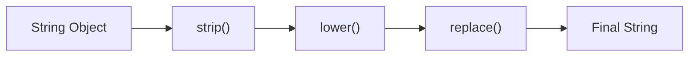
**Why are methods preferable to ordinary functions?**

Methods improve

-   readability
-   organization
-   discoverability
-   consistency

Instead of writing

`upper(text)` Python encourages
`text.upper()` which clearly indicates that the operation belongs to the string object itself.

**Common beginner mistakes**

| **Mistake** | **Explanation** |
| --- | --- |
| Forgetting parentheses (text.upper) | Refers to the method itself instead of calling it |
| Assuming methods modify the string | Most string methods return a new string |
| Trying to call string methods on integers | Only string objects have string methods |
| Ignoring the returned value | The original string remains unchanged |

**Key Points**

-   Strings are objects of the built-in str class.
-   Methods define the behaviour of string objects.
-   The dot operator invokes a method on an object.
-   Most string methods return new strings because strings are immutable.
-   Method chaining provides a concise and readable way to perform multiple operations on the same string.


**Question 14. Common string methods. Classify and compare them. When should each method be preferred? Explain how these methods demonstrate string immutability.**

**Answer**

Python's str class provides a rich collection of built-in methods for processing textual data. Rather than writing lengthy loops for common operations, programmers can simply invoke the appropriate method. These methods make programs shorter, easier to read, and less error-prone.

A useful way to understand string methods is to classify them according to the type of operation they perform.

**Classification of Common String Methods**

| **Category** | **Methods** | **Purpose** |
| --- | --- | --- |
| Case Conversion | lower(), upper() | Change letter case |
| Whitespace Handling | strip() | Remove unwanted spaces |
| Splitting & Joining | split(), join() | Convert between strings and lists |
| Searching | find(), index() | Locate substrings |
| Modification | replace() | Replace substrings |
| Boundary Testing | startswith(), endswith() | Check prefixes/suffixes |
| Counting | count() | Count occurrences |

**Case Conversion Methods**

These methods normalize text.
```python
name = "PyThOn"
print(name.lower())
print(name.upper())
```
Output
```python
python
PYTHON
```
Typical applications include

-   case-insensitive searching
-   normalizing user input
-   displaying headings

**Whitespace Removal**

Extra spaces often appear when data comes from users or files.
```python
text = " Python "
print(text.strip())
```
Output
```python
Python
```
Without cleaning, comparisons may fail.

**Splitting and Joining**

Sometimes we need to convert one string into many smaller strings.
```python
line = "Red,Green,Blue"
colors = line.split(",")
print(colors)
```
Output
```python
['Red', 'Green', 'Blue']
```
To rebuild the string,
```python
print("-".join(colors))
```
Output
```python
Red-Green-Blue
```
Notice that

-   split() returns a **list**
-   join() returns a **string**

**Searching Methods**

Python offers two similar searching methods.
```python
text = "Programming"
print(text.find("gram"))
print(text.index("gram"))
```
Both return
`3`

However, if the substring does not exist,

`text.find("Java")`
returns
`-1`

whereas
`text.index("Java")`
raises
`ValueError`

Therefore,

-   use find() when failure is expected,
-   use index() when the substring must exist.

**Modification**
```python
sentence = "I like Java"
new_sentence = sentence.replace("Java", "Python")
```
The original string remains unchanged.

**Boundary Testing**
```python
filename = "report.pdf"
print(filename.endswith(".pdf"))
print(filename.startswith("rep"))
```
These methods are especially useful when validating filenames, URLs, and commands.

**Counting**
```python
sentence = "banana"
print(sentence.count("a"))
```
Output
`3`

Unlike find(), count() never returns -1.

**Relationship with Immutability**

One of the most important concepts for beginners is that **none of these methods modify the original string**.

Consider
```python
text = "Python"
result = text.upper()
print(text)
print(result)
```
Output
```python
Python
PYTHON
```
The original object remains unchanged because strings are immutable.

**Flowchart**
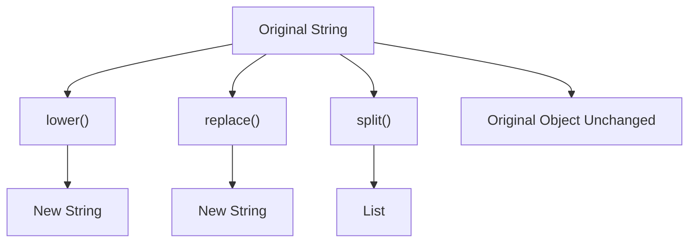
**Choosing the Appropriate Method**

| **Requirement** | **Preferred Method** |
| --- | --- |
| Ignore case | lower() |
| Remove spaces | strip() |
| Break sentence | split() |
| Join words | join() |
| Replace text | replace() |
| Search safely | find() |
| Search when mandatory | index() |
| Count occurrences | count() |
| Validate extension | endswith() |

**Common Beginner Mistakes**

| **Mistake** | **Explanation** |
| --- | --- |
| Expecting methods to modify the string | Most return a new object |
| Using index() without exception handling | May raise ValueError |
| Confusing split() and join() | One creates a list, the other creates a string |
| Ignoring the returned value | The result is lost |

**Key Points**

-   String methods simplify common text-processing tasks.
-   Different methods serve different categories of operations.
-   Most methods return a **new string**.
-   split() returns a list, while join() returns a string.
-   Understanding method categories helps programmers select the most appropriate tool.

**Question 15. The `is...()` family of methods. What are they? Why are they important for input validation? Compare the commonly used methods and discuss their limitations.**

**Answer**

Many programs accept input from users. Before processing that input, it is important to verify that it satisfies certain conditions. For example, an age should contain only digits, while a person's name should usually contain only alphabetic characters.

Python provides a family of methods beginning with **is** that answer such questions. These methods **inspect** a string and return either True or False. They do **not** modify the string.

These methods are widely used in data validation, form processing, and interactive applications.

**Common `is...()` Methods**

| **Method** | **Returns True When** |
| --- | --- |
| isalpha() | All characters are alphabetic |
| isdigit() | All characters are digits |
| isalnum() | All characters are letters or digits |
| isspace() | All characters are whitespace |
| isupper() | All cased characters are uppercase |
| islower() | All cased characters are lowercase |

**isalpha()**
```python
print("Python".isalpha())
print("Python3".isalpha())
```
Output
```python
True
False
```
Useful for validating names.

**isdigit()**
```python
print("12345".isdigit())
print("12.5".isdigit())
```
Output
```python
True
False
```
Notice that decimal points are **not** digits.

**isalnum()**
```python
print("User123".isalnum())
print("User 123".isalnum())
```
Output
```python
True
False
```
Spaces and punctuation are not allowed.

**isspace()**
```python
print(" ".isspace())
print(" A ".isspace())
```
Output
```python
True
False
```
Useful when checking whether the user entered only blank characters.

**isupper() and islower()**
```python
print("HELLO".isupper())
print("hello".islower())
```
Output
```python
True
True
```
These methods are commonly used before comparing text or enforcing formatting rules.

**Why are these methods important?**

Suppose a program asks the user to enter an age.
```python
age = input("Enter age: ")
if age.isdigit():
    age = int(age)
print("Valid age")

else:
    print("Invalid input")
```
Without validation,

`int("abc")` would raise a `ValueError`.

Validation therefore improves program reliability.

**Flowchart**
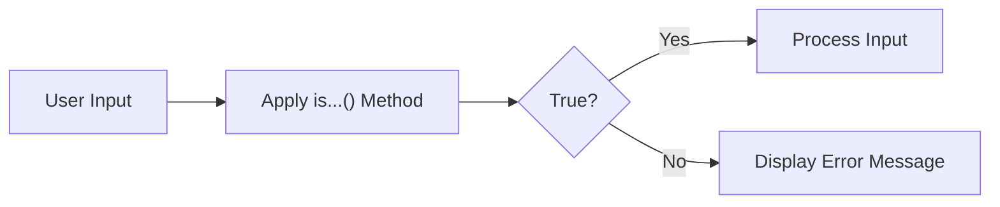
**Comparison Table**

| **Method** | **Returns** | **Typical Application** |
| --- | --- | --- |
| isalpha() | Boolean | Validate names |
| isdigit() | Boolean | Validate ages, roll numbers |
| isalnum() | Boolean | Validate usernames |
| isspace() | Boolean | Detect blank input |
| isupper() | Boolean | Verify uppercase text |
| islower() | Boolean | Verify lowercase text |

**Limitations**

Although these methods are useful, they are not perfect.

**isdigit()**

Returns False for
```python
-15
3.14
+25
```
because -, +, and . are not digits.

**isalpha()**

Returns False for
`John Smith`
because of the space.

**isalnum()**
Returns False for
`user_name`
because _ is neither a letter nor a digit.

**Empty String**

An important point often overlooked by beginners is that
```python
"".isalpha()
"".isdigit()
"".isalnum()
```
all return
`False`

An empty string does not satisfy any of these conditions because it contains no characters.

**Common Beginner Mistakes**

| **Mistake** | **Explanation** |
| --- | --- |
| Assuming isdigit() accepts negative numbers | It does not |
| Expecting isalpha() to allow spaces | Spaces are not alphabetic |
| Forgetting that empty strings return False | Validate for empty input separately |
| Assuming these methods modify the string | They only inspect it |

**Practical Applications**

These methods are frequently used in

-   login forms
-   registration systems
-   examination software
-   banking applications
-   web forms
-   command-line programs
-   file validation
-   educational software

**Key Points**

-   The is...() family performs **validation**, not modification.
-   Every method returns a Boolean value.
-   They are commonly used to verify user input before processing.
-   Different methods validate different characteristics of a string.
-   Programmers should understand their limitations, especially with negative numbers, decimal values, spaces, and empty strings.

**Question 16. f-Strings. Why were they introduced? Compare them with concatenation and str.format(). What are their advantages?**

**Answer**

Formatting strings is one of the most common tasks in programming. Programs frequently display variables, calculations, and messages to users. Before Python 3.6, programmers mainly used **string concatenation** (`+`) or the **`str.format()`** method for formatting text. Although both techniques are useful, they can become difficult to read when many variables are involved.

Python introduced **formatted string literals**, commonly known as **f-strings**, to provide a simpler, more readable, and more efficient way to construct strings.

An f-string is created by prefixing the string literal with the letter f (or F). Expressions enclosed within curly braces {} are evaluated automatically and their values are inserted into the resulting string.

Example:
```python
name = "Alice"
marks = 92
print(f"{name} scored {marks} marks.")
```
Output
```python
Alice scored 92 marks.
```
Unlike concatenation, explicit type conversion is usually unnecessary.

**Comparison of Formatting Techniques**

| **Technique** | **Example** | **Advantages** | **Disadvantages** |
| --- | --- | --- | --- |
| Concatenation | "Age: " + str(age) | Simple | Requires manual conversion |
| str.format() | "Age: {}".format(age) | Flexible | More verbose |
| f-String | f"Age: {age}" | Readable, concise, efficient | Requires Python 3.6+ |

**Expressions Inside f-Strings**

One of the greatest strengths of f-strings is that they can evaluate expressions directly.
```python
a = 10
b = 20
print(f"Sum = {a + b}")
print(f"Square = {a \*\* 2}")
```
Output
```python
Sum = 30
Square = 100
```
**Flowchart**
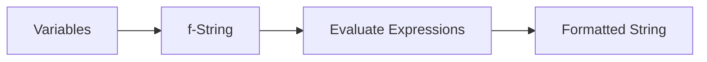
**Common Beginner Mistakes**

| **Mistake** | **Explanation** |
| --- | --- |
| Forgetting the f prefix | Expressions are printed literally |
| Omitting {} | Variables are not evaluated |
| Mixing concatenation unnecessarily | f-strings are usually clearer |

**Key Points**

-   f-Strings improve readability and reduce code complexity.
-   Variables and expressions are enclosed in {}.
-   Automatic conversion reduces the need for str().
-   f-Strings are generally the preferred formatting technique in modern Python.

**Question 17. Palindrome using indexing. Explain the algorithm, logic, efficiency, and limitations.**

**Answer**

A **palindrome** is a string that reads the same in both forward and reverse directions.

Examples include
```python
madam
level
radar
```
The indexing approach compares corresponding characters from the beginning and end of the string.

Algorithm:

1.  Compare the first and last characters.
2.  Compare the second and second-last characters.
3.  Continue until the middle of the string is reached.
4.  If every pair matches, the string is a palindrome.

**Example**
```python
text = input("Enter a string: ")
is_palindrome = True
for i in range(len(text) // 2):  
    if text[i] != text[-(i + 1)]:
    is_palindrome = False
    break

if is_palindrome:
    print("Palindrome")
else:
    print("Not a palindrome")
```
**Why Compare Only Half?**
Every comparison checks two characters simultaneously.
For a string of length n, only n/2 comparisons are required.

**Flowchart**
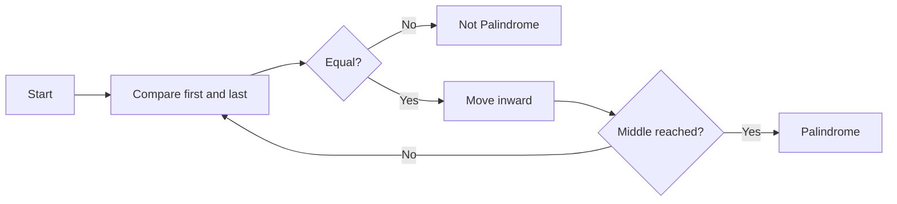
**Advantages**

-   Efficient
-   Uses indexing concepts
-   Does not create another string
-   Demonstrates negative indexing

**Limitations**

-   Slightly longer code
-   Requires careful index calculations
-   Beginners may find the logic difficult initially

**Key Points**

-   Uses positive and negative indexing.
-   Stops immediately when a mismatch is found.
-   Requires only half the comparisons.
-   Time complexity is **`O(n)`**.

**Question 18. Palindrome using slicing. Explain the algorithm and compare it with the indexing approach.**

**Answer**

Python's slicing feature makes palindrome checking remarkably simple.

Instead of comparing individual characters, Python can reverse the entire string using `[::-1]`

The reversed string is then compared with the original.

**Example**
```python
text = input("Enter a string: ")
if text == text[::-1]:
    print("Palindrome")

else:
    print("Not a palindrome")
```
**How Does `[::-1]` Work?**

`string[start : stop : step]`

Here,

-   start is omitted
-   stop is omitted
-   step is -1

Python therefore traverses the string from right to left.

**Diagram**
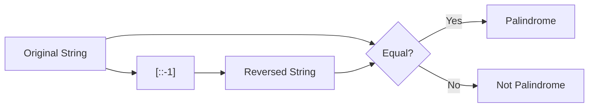
**Advantages**

-   Extremely concise
-   Easy to understand
-   Uses Python's built-in slicing mechanism
-   Very readable

**Limitations**

-   Creates another string in memory
-   Less suitable for explaining the underlying algorithm
-   Hides some implementation details from beginners

**Key Points**

-   Uses slicing rather than loops.
-   Requires only one comparison.
-   Time complexity remains **O(n)**.
-   Excellent example of Pythonic programming.

**Question 19. Palindrome algorithms. Compare the indexing and slicing approaches. Which should beginners learn first?**

**Answer**

Both algorithms correctly determine whether a string is a palindrome. However, they emphasize different programming concepts.

The **indexing method** teaches algorithmic thinking, loops, and character-by-character comparison. The **slicing method** demonstrates Python's expressive syntax and built-in sequence operations.

**Comparison**

| **Feature** | **Indexing Method** | **Slicing Method** |
| --- | --- | --- |
| Readability | Moderate | Excellent |
| Code Length | Longer | Very short |
| Extra Memory | Minimal | Creates reversed string |
| Demonstrates Algorithm | Yes | No |
| Uses Loops | Yes | No |
| Pythonic Style | Moderate | High |

**Which Should Beginners Learn First?**

For educational purposes, beginners should first learn the **indexing approach** because it develops logical reasoning and reinforces concepts such as indexing, loops, and conditional statements.

After mastering the algorithm, they should learn the slicing approach to appreciate Python's expressive features.

**Diagram**
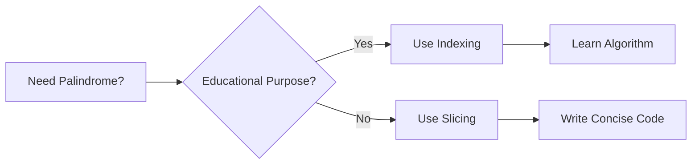
**Key Points**

-   Both algorithms are correct.
-   Indexing develops problem-solving skills.
-   Slicing demonstrates Pythonic programming.
-   Understanding both approaches makes students better programmers.

**Question 20. Strings—comprehensive review. Explain how indexing, slicing, immutability, Unicode, methods, and formatting work together in practical Python programs.**

**Answer**

A string is much more than a collection of characters. It is an immutable Unicode sequence object that supports indexing, slicing, iteration, comparison, formatting, and a large collection of built-in methods.

Understanding strings requires connecting several independent concepts.

**Concept Map**
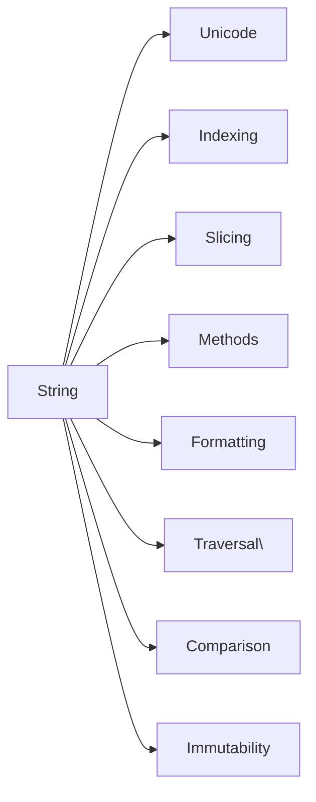
**How the Concepts Work Together**

Suppose a program accepts a user's name.

1.  **Input**

`name = input("Enter your name: ")`

1.  **Whitespace Removal**

`name = name.strip()`

2.  **Case Conversion**

`name = name.title()`

3.  **Validation**

`if name.isalpha():`

4.  **Formatting**

`print(f"Welcome, {name}!")`

Each step uses a different concept from this chapter.

**Summary Table**

| **Concept** | **Purpose** | **Typical Methods/Operations** |
| --- | --- | --- |
| Creation | Create string objects | Quotes, str() |
| Indexing | Access characters | \[\] |
| Slicing | Extract substrings | \[:\] |
| Traversal | Visit each character | for, while |
| Comparison | Compare strings | \==, <, > |
| Formatting | Display values | f-Strings |
| Validation | Check properties | isalpha(), isdigit() |
| Searching | Locate text | find(), index() |
| Modification | Create altered strings | replace(), lower() |
| Unicode | Character representation | ord(), chr() |

**Why Strings Are Central to Programming**

Almost every software application manipulates text.

Examples include:

-   usernames and passwords
-   email addresses
-   filenames and file paths
-   web pages
-   reports
-   search engines
-   databases
-   chat applications
-   programming languages themselves

Mastering strings therefore provides the foundation for learning file handling, regular expressions, web development, databases, data science, and natural language processing.

**Common Beginner Mistakes**

| **Mistake** | **Correct Understanding** |
| --- | --- |
| Strings can be modified | Strings are immutable |
| Index starts at 1 | Index starts at 0 |
| Stop index is included | Stop index is excluded |
| find() and index() are identical | index() raises ValueError if not found |
| isdigit() accepts decimal numbers | Decimal point is not a digit |
| \+ modifies a string | It creates a new string |

**Final Key Takeaways**

-   Strings are **immutable Unicode sequences**.
-   Most string operations produce **new objects** rather than modifying existing ones.
-   Indexing and slicing provide efficient access to characters and substrings.
-   Built-in methods simplify common text-processing tasks.
-   Validation methods help ensure correct user input.
-   f-Strings offer the most readable way to format output.
-   A strong understanding of strings is essential because text processing is fundamental to almost every area of Python programming.


