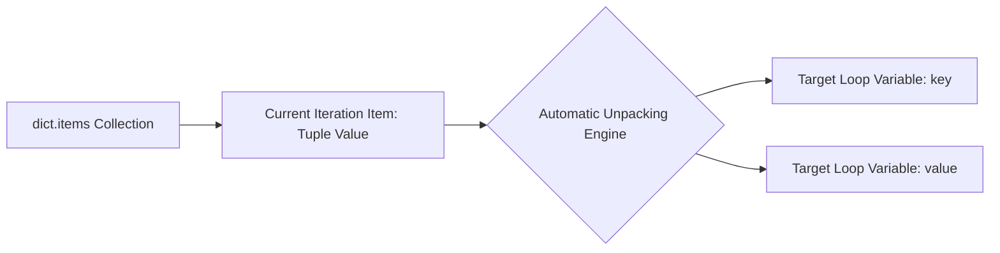

**Q1. Define syntactic criteria for tuples. Why does x = (5) fail to produce a tuple?**

An object is not structurally defined as a tuple by the presence of round parentheses (), but rather by the presence of commas , separating its elements. Parentheses serve primarily as grouping operators to maintain layout readability. When the expression `x = (5)` is parsed, Python treats the parentheses as a standard mathematical grouping operation, evaluating x as a primitive integer. To instantiate a single-element tuple, a trailing comma must be appended explicitly—such as `y = (5,)`—which signals the parser to construct a tuple instance containing one element. Empty tuples `empty_tuple = ()` are an exception where the absence of items enclosed by parentheses explicitly initializes an empty sequence container. 

**Q2. Differentiate `t1 = 10, 20, 30` and `t2 = (10, 20, 30)` mechanically. Which is preferred?**

Mechanically, both expressions evaluate identically inside the CPython interpreter, translating to the creation of a standard three-element tuple object. The initialization statement `t1 = 10, 20, 30` utilizes an implicit syntax known as tuple packing. However, the syntax used in `t2 = (10, 20, 30)` is highly preferred in professional application design because explicit parentheses avoid parsing ambiguities when writing nested data frameworks, defining data layouts, or passing literal structures as parameters directly into function calls. 

**Q3. Detail tuple behavior under item assignment. Why do mutations trigger a TypeError?**

Tuples are strictly immutable sequences. Once an allocated memory instance of a tuple is initialized, its internal reference pointers are fixed forever. If you execute a direct element modification statement such as: 
```python
t = (10, 20, 30)
t[0] = 100
```
The interpreter intercepts the request and refuses to call an internal slot for item modification. Because mutability structural slots are completely missing from its object type definition, Python immediately halts execution and throws a `TypeError`: 'tuple' object does not support item assignment. 

**Q4. Contrast available methods between lists and tuples. Why do these differences exist?**

Tuples only possess read-only querying methods that inspect properties without altering underlying data references, specifically .count() and .index(). Conversely, lists possess an array of in-place mutation methods, including `.append(), .insert(), .extend(), .remove()`, and `.pop()`. This variation is due to their core architectural constraints: lists are dynamic, mutable sequences designed for expanding data arrays, whereas tuples are immutable structures engineered to represent stable data points. 

**Q5. Explain how `t1 = t1 + (4, 5)` modifies a variable. Trace memory via id().**

Executing `t1 = t1 + (4, 5)` does not mutate the existing tuple object in memory. Instead, it uses the sequence concatenation operator + to read the components of both tuples, allocate an entirely new tuple structure elsewhere in memory, and rebind the reference variable t1 to point to this fresh instance. Tracking the system identifier reveals this shift clearly: 
```python
t1 = (1, 2, 3)
print(id(t1))  # Output: e.g., 140223405703808

t1 = t1 + (4, 5)
print(id(t1))  # Output: e.g., 140223405624448 (A completely different memory ID)
```
The original tuple instance `(1, 2, 3)` remains unchanged at its original address until it is cleaned up by the garbage collector. 

**Q6. How does tuple slicing allocate memory? Explain original vs. sliced object states.**

Tuple slicing using the syntax `tuple[start:stop:step]` reads a specified index range and returns a brand-new tuple instance containing references to those extracted elements. Because tuples are immutable, this operation leaves the original object completely untouched in memory. For example, running `t1 = t[1:3]` extracts a window into `t1` without changing t, which guarantees that data references remain safe from side effects across your codebase. 

**Q7. Map performance differences between lists and tuples across memory and execution.**

When optimizing performance-critical Python applications, tuples outperform lists across three primary architectural metrics:


Efficiency Parameter	Python list Architecture	Python tuple Architecture
Memory Allocation	Allocates extra over-provisioned slots to handle future append mutations efficiently. 	Allocates the exact block size needed for the elements at instantiation. 
Execution Speed	Slower under-the-hood operations due to pointer indirection and resizing logic. 	Highly optimized, direct read access speeds within the runtime engine. 
Data Integrity	Vulnerable to accidental programmatic mutations across shared module references. 	Guaranteed read-only immutability that serves as a permanent architectural lock. 


**Q8. Detail tuple packing vs. unpacking. What happens during structural mismatches?**

Tuple packing combines individual expressions into a single consolidated tuple object, whereas unpacking extracts elements back out into distinct target variables. 
```python
t = 10, 20, 30  # Packing values into a single tuple
a, b, c = t     # Unpacking elements out into separate variables
```
If the number of target variables on the left side does not perfectly match the element count inside the tuple, Python halts execution with a ValueError. For example, attempting `a, b = (10, 20, 30)` raises `ValueError`: too many values to unpack (expected 2), while `a, b, c = (10, 20)` raises `ValueError`: not enough values to unpack (`expected 3, got 2`). 

**Q9. Explain extended unpacking via `*rest`. What data type is captured?**

Extended unpacking uses the starred operator `*` to capture any leftover elements during an assignment operation that don't match explicit positional variables. 
```python
a, *rest = (1, 2, 3, 4)
```
Here, a extracts the first element 1, while `*rest` gathers the remaining elements into a collection. Regardless of the fact that the source object is an immutable tuple, Python intentionally collects these extra items into a mutable list type (`[2, 3, 4]`). This design choice gives you a flexible list structure that is immediately ready for any subsequent data manipulation or array operations your script needs. 

**Q10. Detail tuple behavior when cast from a dict via tuple(d) vs. tuple(d.values()).**

When a dictionary is passed directly into the tuple constructor `tuple(d)`, Python iterates over the collection and extracts only its keys, converting them into a tuple sequence. To extract the payload data instead, you must explicitly call the `.values()` view method before casting. 
```python
d = {'a': 1, 'b': 2}
print(tuple(d))           # Output: ('a', 'b') - Extracts keys only
print(tuple(d.values()))  # Output: (1, 2)     - Extracts values explicitly
```

**Q11. Explain sorting tuples using sorted(). Contrast its return type with tuple immutability.**

Because tuples are immutable, they do not possess an in-place `.sort()` method. To sort a tuple, you must pass it to the built-in global function `sorted(t)`. This function reads the iterable elements, performs a stable sort, and returns the sorted items inside a new mutable list container. This behavior ensures the original tuple remains completely unaltered, preserving its read-only guarantee. 
```python
t = (3, 1, 4)
result = sorted(t)
print(result)        # Output: [1, 3, 4] -> Notice it is a list!
print(type(result))  # Output: <class 'list'>
```

**Q12. How does Python evaluate bool(()), bool((0,)), and bool((None,))? Explain.**

Python determines the truthiness of a tuple container in a boolean context entirely by its element count, completely ignoring the values or types of the items inside it. 
•	`bool(())` evaluates to `False` because the tuple is empty. 
•	`bool((0,))` evaluates to `True` because it contains a single item (the integer 0), making it a non-empty collection. 
•	`bool((None,))` evaluates to `True` because it holds one element (the `None` object), which satisfies the non-empty rule. 


**Q13. State requirements for dictionary keys. Can a tuple containing a list be a key?**

For an object to serve as a dictionary key or set element in Python, it must be completely immutable and hashable. While tuples are structurally immutable, a tuple is only hashable if every single element inside it is also hashable. If a tuple contains a mutable object like a list, its hashability breaks. 
```python
# Fails with TypeError: unhashable type: 'list'
invalid_key = (1, [2, 3])
my_dict = {invalid_key: "Error Case"}
```
Because the nested list can change its state at runtime, the outer tuple cannot generate a stable hash value, causing Python to throw a TypeError to protect data consistency. 


**Q14. How does Python handle return a, b from a function? Explain calling unpacks.**

When a function executes a multi-value statement like return a, b, Python adheres to the rule that functions can only return exactly one object. To handle this, the runtime automatically packs the expressions into a single tuple instance before passing it back. The calling script can then instantly unpack this returned tuple directly into separate variables in a single step: 
```python
def get_data():
    return 100, 200  # Automatically packed into a tuple

x, y = get_data()    # Instantly unpacked into distinct variables
```

**Q15. Explain Pythonic variable swapping via `a, b = b, a` without temporary storage.**

Traditional variable swapping requires allocating a temporary variable to prevent overwriting data during execution. Python replaces this multi-step approach with an elegant, single-line tuple assignment: 
```python
a, b = b, a
```
Behind the scenes, the CPython runtime evaluates the right-hand expressions first, packing b, a into a hidden, transient tuple instance. It then immediately unpacks this temporary tuple into the target variable targets on the left-hand side, safely completing the swap without needing manual storage variables. 

**Q16. How does loop unpacking operate on `dict.items()` collections? Detail the steps.**

When you loop through a dictionary using for key, value in `d.items()`:, the `.items()` method generates a sequence of two-element key-value tuples. During each step of the loop, Python takes the current tuple and automatically unpacks its contents directly into your named loop variables. 

This built-in unpacking mechanic eliminates the need to manually index individual elements, making your loops significantly cleaner and easier to read. 

**Q17. Explain structural pattern matching (match-case) on tuples. Detail the flow.**

Introduced in Python 3.10, the match-case statement evaluates composite tuple shapes and element values simultaneously using built-in unpacking logic. 
```python
status = (404, "Not Found")
match status:
    case (200, msg): print(f"Success: {msg}")
    case (404, msg): print(f"Error Alert: {msg}")  # Matches here
```
During execution, the runtime verifies both the structure and the values: it ensures the target object is a two-element tuple, checks for matching literal values (like 404), and automatically binds the remaining elements to local variables (like msg). 

**Q18. Explain nested tuple indexing. How do you extract `3` from `((1, 2), (3, 4))`?**


Accessing elements inside nested tuple frameworks requires chaining multiple sets of square brackets `[]`, with each set moving down one layer of the nested sequence structure. To extract the integer value 3 from `t = ((1, 2), (3, 4))`, you use the chained statement `t[1][0]`. The first index [1] targets the second nested tuple `(3, 4)`, and the second index `[0]` selects the first element within that inner tuple. 

**Q19. Analyze tuple comparison behavior for equality `==` vs. identity `is`.**

The equality operator `==` checks whether two tuples contain identical values in the exact same sequence order, returning `True` if the data matches. The identity operator `is` checks whether both variables point to the exact same object address in memory. 
```python
t1 = (1, 2, 3)
t2 = (1, 2, 3)
print(t1 == t2)  # Output: True (The data values match perfectly)
print(t1 is t2)  # Output: False (They are distinct objects in memory)
```


**Q20. Detail how to simulate element removal from an immutable tuple using slicing.**

Because tuples are strictly immutable, you cannot remove or pop elements from them directly. To alter the data, you must simulate the removal by using slicing operators to extract the desired portions, then concatenating those pieces together to build a brand-new tuple instance that leaves out the unwanted item. 
```python
t = ('a', 'b', 'c', 'd')
# To "remove" index position 2 ('c')
new_t = t[:2] + t[3:]
print(new_t)  # Output: ('a', 'b', 'd')
```
This approach keeps the original tuple t completely safe and unchanged in memory, preserving data safety across your program. 


